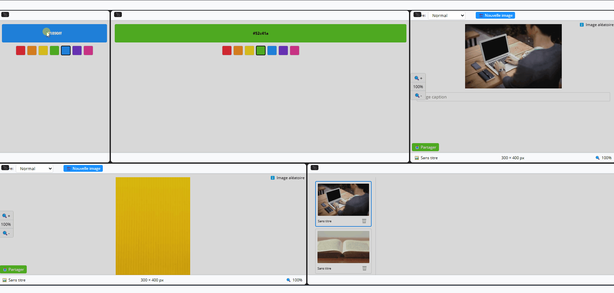

<div align="center" style="display:flex;flex-direction:column;">
    
  <h3>KARMYC - multimodal editor</h3>
</div>

# Karmyc Monorepo

[](https://www.npmjs.com/package/@gamesberry/karmyc-core)
[](https://github.com/your-username/karmyc/blob/main/LICENSE)
[](https://www.npmjs.com/package/@gamesberry/karmyc-core)
[](https://www.typescriptlang.org/)
[](https://reactjs.org/)

Un éditeur multimodal React pour la création d'interfaces complexes.

<div align="center" style="display:flex;flex-direction:column;">
    
</div>

## Structure du Monorepo

Ce projet est organisé comme un monorepo avec les packages suivants :

### Packages Principaux
- **[@gamesberry/karmyc-core](./packages/core)** - Système de layout principal avec drag & drop, panneaux redimensionnables et gestion d'état
- **[@gamesberry/karmyc-editor](./packages/editor)** - Interface utilisateur principale de l'éditeur

### Plugins
- **[@gamesberry/karmyc-plugins/inspector](./packages/plugins/inspector)** - Inspecteur d'objets
- **[@gamesberry/karmyc-plugins/context-menu](./packages/plugins/context-menu)** - Menus contextuels
- **[@gamesberry/karmyc-plugins/workspace](./packages/plugins/workspace)** - Gestion des espaces de travail
- **[@gamesberry/karmyc-plugins/history](./packages/plugins/history)** - Historique des actions
- **[@gamesberry/karmyc-plugins/keyboard](./packages/plugins/keyboard)** - Gestion des raccourcis clavier
- **[@gamesberry/karmyc-plugins/primitive](./packages/plugins/primitive)** - Formes primitives
- **[@gamesberry/karmyc-plugins/project](./packages/plugins/project)** - Gestion des projets
- **[@gamesberry/karmyc-plugins/assets](./packages/plugins/assets)** - Gestion des assets
- **[@gamesberry/karmyc-plugins/viewport](./packages/plugins/viewport)** - Gestion de la vue
- **[@gamesberry/karmyc-plugins/layer](./packages/plugins/layer)** - Système de calques

### Layers
- **[@gamesberry/karmyc-layers/map](./packages/layers/map)** - Calques de type carte
- **[@gamesberry/karmyc-layers/html](./packages/layers/html)** - Calques HTML
- **[@gamesberry/karmyc-layers/composite](./packages/layers/composite)** - Calques composites
- **[@gamesberry/karmyc-layers/tilemap](./packages/layers/tilemap)** - Calques de tuiles
- **[@gamesberry/karmyc-layers/simple-color](./packages/layers/simple-color)** - Calques de couleur simple

## Features

- **Modular Layouts**: Create and arrange areas in flexible configurations
- **Customizable Areas**: Build any type of area with your own rendering logic
- **Drag & Drop**: Intuitive drag and drop interface for rearranging areas
- **Resizable Panels**: Adjust panel sizes with fluid resizing
- **State Management**: Integrated store for state management
- **Undo/Redo**: Built-in history management
- **Context Menus**: Configurable context menus for enhanced interactions
- **Plugin System**: Extend functionality with plugins (like area-projects)

## Roadmap / Wishlist

- Area as a dialog
- Presets
- Customizable themes (light/dark mode and configurable color palettes)
- Fullscreen mode for specific areas
- Export/import of layout configurations
- Responsive/mobile support
- Improved accessibility (ARIA, keyboard navigation)
- Global Command Palette / search functionality

## Spaces in Karmyc

In Karmyc, **Spaces** are a core concept that allows you to group areas together that should share a common context. Spaces provide a way to organize your UI components and determine how they interact with each other.

### Key Features of Spaces

- **Grouped Context**: Areas within the same space can share data and state
- **Isolated Environments**: Different spaces operate independently
- **Selective Sharing**: You can choose which areas belong to which spaces

### When to Use Spaces

Use spaces when you want to:
- Create multiple independent working environments
- Group related areas that should react to the same actions
- Separate unrelated components that should function independently

### Example Use Cases

- **Color Pickers**: Group color pickers in the same space to sync their color selection
- **Document Editing**: Group document editor areas to share the same document context
- **Multi-project Support**: Switch between different projects with their own state

### Using Spaces API

```tsx
import { useSpace, useArea } from '@gamesberry/karmyc-core';

function MyComponent() {
  const { createSpace, updateSharedState, spaces, activeSpace } = useSpace();
  const { createArea, getAreasBySpaceId } = useArea();
  
  // Create a new space
  const handleCreateProject = () => {
    createSpace('My New Project', { color: '#ff0000' });
  };
  
  // Create area in the active space
  const handleCreateArea = () => {
    if (activeSpace) {
      createArea('color-picker', { color: activeSpace.sharedState.color }, undefined, activeSpace.id);
    }
  };
  
  // Update all areas in a space
  const handleUpdateSpaceColor = (color) => {
    if (activeSpace) {
      updateSharedState(activeSpace.id, { color });
    }
  };
  
  return (
    <div>
      {/* Component UI */}
    </div>
  );
}
```

## Système de Thème

Karmyc inclut un système de thème complet avec support des modes clair et sombre. Le système utilise des variables CSS pour garantir une cohérence visuelle et faciliter la personnalisation.

### Caractéristiques

- Support des modes clair et sombre
- Variables CSS pour une personnalisation facile
- Transitions fluides entre les thèmes
- Respect des préférences système
- Persistance des préférences utilisateur

### Documentation

Pour plus de détails sur l'utilisation et la personnalisation du système de thème, consultez le [Guide du Système de Thème](./docs/guides/theming.md).

## Installation

```bash
# Installation des dépendances
yarn install

# Build de tous les packages
yarn build

# Package core
yarn add @gamesberry/karmyc-core

# Plugins (optionnels)
yarn add @gamesberry/karmyc-plugins/inspector
yarn add @gamesberry/karmyc-plugins/context-menu
# ... autres plugins selon besoin
```

## Quick Start

```tsx
import React from 'react';
import { 
  KarmycProvider, 
  Karmyc, 
  useRegisterAreaType, 
  useArea 
} from '@gamesberry/karmyc-core';

// Define a custom area component
const TextNoteArea = ({ areaState, width, height }) => (
  <div style={{ width, height }}>
    <h3>Text Note</h3>
    <p>{areaState.content}</p>
  </div>
);

function App() {
  // Register area types
  useRegisterAreaType(
    'text-note',
    TextNoteArea,
    { content: 'Initial content' },
    {
      displayName: 'Text Note',
      defaultSize: { width: 300, height: 200 }
    }
  );
  
  // Get area creation function
  const { createArea } = useArea();
  
  return (
    <div>
      <button onClick={() => createArea('text-note', { content: 'New note' })}>
        Add Text Note
      </button>
      <Karmyc />
    </div>
  );
}

export default function Root() {
  return (
    <KarmycProvider>
      <App />
    </KarmycProvider>
  );
}
```

## Développement

```bash
# Installation des dépendances
yarn install

# Build de tous les packages
yarn build

# Watch sur des packages spécifiques
yarn watch:core
yarn watch:editor
yarn watch:plugins

# Développement simultané de tous les packages
yarn dev:all

# Lancer l'éditeur en mode développement
yarn dev:editor
```

## Documentation

La documentation est organisée en plusieurs sections :

### API Reference
- [Components](./docs/api/components.md) - Documentation des composants
- [Hooks](./docs/api/hooks.md) - Documentation des hooks React
- [Integration](./docs/api/integration.md) - Guide d'intégration React

### Architecture
- [Redux Store](./docs/architecture/store.md) - Structure du store
- [Action System](./docs/architecture/actions.md) - Architecture des actions
- [State Transitions](./docs/architecture/state-transitions.md) - Système de transitions d'état
- [Project Structure](./docs/architecture/project-structure.md) - Organisation des fichiers et répertoires
- [Monorepo Structure](./docs/architecture/monorepo.md) - Organisation du monorepo

### Guides
- [Getting Started](./docs/guides/getting-started.md) - Configuration initiale
- [Custom Areas](./docs/guides/custom-areas.md) - Création d'aires personnalisées
- [Optimizations](./docs/guides/optimizations.md) - Conseils d'optimisation
- [Creating Plugins](./docs/guides/plugins.md) - Création de plugins

## Examples

See the [examples](./packages/examples) directory for working demos:

- Basic layout
- Custom area types
- Context menus
- Drag and drop
- Using plugins

## Contribution

Les contributions sont les bienvenues ! Consultez notre [Guide de Contribution](./CONTRIBUTING.md) pour plus de détails.

## Acknowledgements

Karmyc was inspired by and mainly derived from [animation-editor](https://github.com/alexharri/animation-editor) by [@alexharri](https://github.com/alexharri) - a web-based animation editor built with React, Redux, PIXI.js and HTML Canvas.

## Licence

MIT © [Yann Loosli](https://github.com/example)


# Karmyc Core

[](https://www.npmjs.com/package/@gamesberry/karmyc-core)
[](https://github.com/your-username/karmyc/blob/main/LICENSE)

Core layout system with drag & drop, resizable panels, and state management for the Karmyc editor.

## Features

- **Modular Layouts**: Create and arrange areas in flexible configurations
- **Customizable Areas**: Build any type of area with your own rendering logic
- **Drag & Drop**: Intuitive drag and drop interface for rearranging areas
- **Resizable Panels**: Adjust panel sizes with fluid resizing
- **State Management**: Integrated store for state management
- **Undo/Redo**: Built-in history management
- **Context Menus**: Configurable context menus for enhanced interactions

## Installation

```bash
# Using yarn (recommended)
yarn add @gamesberry/karmyc-core

# Using npm
npm install @gamesberry/karmyc-core
```

## Quick Start

```tsx
import React from 'react';
import { 
  KarmycProvider, 
  Karmyc, 
  useRegisterAreaType, 
  useArea 
} from '@gamesberry/karmyc-core';

// Define a custom area component
const TextNoteArea = ({ areaState, width, height }) => (
  <div style={{ width, height }}>
    <h3>Text Note</h3>
    <p>{areaState.content}</p>
  </div>
);

function App() {
  // Register area types
  useRegisterAreaType(
    'text-note',
    TextNoteArea,
    { content: 'Initial content' },
    {
      displayName: 'Text Note',
      defaultSize: { width: 300, height: 200 }
    }
  );
  
  // Get area creation function
  const { createArea } = useArea();
  
  return (
    <div>
      <button onClick={() => createArea('text-note', { content: 'New note' })}>
        Add Text Note
      </button>
      <Karmyc />
    </div>
  );
}

export default function Root() {
  return (
    <KarmycProvider>
      <App />
    </KarmycProvider>
  );
}
```

## API Reference

For detailed documentation on components, hooks, and API usage, please refer to the main [documentation](../../docs/api).

## Related Packages

- [@gamesberry/karmyc-examples](../examples) - Example applications 
