# Document Technique : Analyse de la Structure du Système de Mise en Page

## 1. Introduction

Ce document présente l'analyse détaillée de la structure actuelle du système de mise en page de l'éditeur d'animation. Cette analyse s'inscrit dans le cadre du projet de refactorisation visant à créer un système de mise en page central, modulaire et maintenable.

## 2. Vue d'ensemble de l'architecture

Le système de mise en page actuel est composé de plusieurs modules interconnectés qui gèrent différents aspects de l'interface utilisateur et de l'état de l'application. L'architecture est principalement basée sur Redux avec des extensions personnalisées pour la gestion de l'historique, des opérations complexes et des différences.

### 2.1 Composants principaux

Le système est actuellement réparti dans les dossiers suivants :

- `area` : Gestion des zones d'affichage
- `state` : Gestion de l'état global
- `contextMenu` : Menus contextuels
- `project` : Gestion des projets
- `diff` : Système de comparaison
- `toolbar` : Interface des barres d'outils
- `listener` : Système d'écoute d'événements
- `history` (sous-dossier de `state`) : Gestion de l'historique

### 2.2 Architecture de l'état

L'architecture de l'état est basée sur deux niveaux principaux :

1. **ApplicationState** : L'état complet de l'application, incluant l'historique des actions
2. **ActionState** : L'état actuel sans l'historique, utilisé pour les opérations courantes

Cette distinction permet une gestion fine de l'historique tout en maintenant des performances optimales pour les opérations courantes.

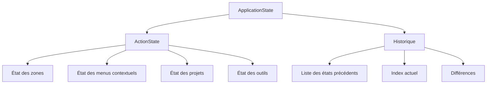

## 3. Analyse détaillée des composants

### 3.1 Système de gestion des zones (`area`)

#### 3.1.1 Structure et fonctionnalités

Le dossier `area` contient les éléments nécessaires pour gérer les différentes zones d'affichage de l'application :

- **Registre de zones** (`areaRegistry.tsx`) : Enregistre les différents types de zones disponibles (Timeline, Workspace, FlowEditor, History, Project) avec leurs composants React associés et leurs reducers spécifiques.
- **Opérations sur les zones** (`areaOperations.ts`) : Définit des opérations complexes comme le déplacement de zones, qui peuvent impliquer plusieurs actions atomiques.
- **Structure des zones** : Les zones sont organisées en lignes (`AreaRowLayout`) avec une orientation spécifique (horizontale ou verticale).

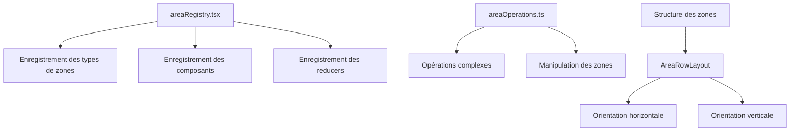

#### 3.1.2 Types principaux

```typescript
// Types de zones disponibles
enum AreaType {
  Timeline,
  Workspace,
  FlowEditor,
  History,
  Project
}

// Structure d'une zone
interface Area {
  id: string;
  type: AreaType;
  state: AreaState<any>;
  size: number;
}

// Structure d'une ligne de zones
interface AreaRowLayout {
  id: string;
  orientation: AreaRowOrientation; // "horizontal" | "vertical"
  areas: Area[];
}
```

### 3.2 Système de gestion d'état (`state`)

#### 3.2.1 Structure et fonctionnalités

Le dossier `state` contient les éléments centraux pour la gestion de l'état global :

- **Store Redux** (`store.ts`) : Configure le store Redux central.
- **Reducers combinés** (`reducers.ts`) : Combine tous les reducers de l'application.
- **Opérations** (`operation.ts`) : Définit un système pour regrouper plusieurs actions et les soumettre ensemble.
- **Annulation/rétablissement** (`undoRedo.ts`) : Implémente les fonctionnalités d'annulation et de rétablissement.
- **Utilitaires d'état** (`stateUtils.ts`) : Fournit des fonctions utilitaires pour manipuler l'état.

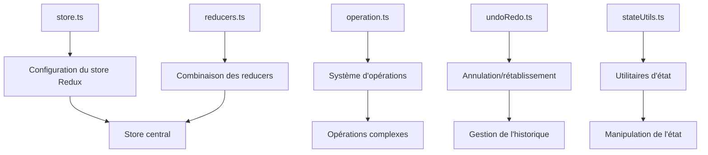

#### 3.2.2 Système d'opérations

Le système d'opérations permet de regrouper plusieurs actions et de les soumettre ensemble, ce qui est essentiel pour maintenir la cohérence de l'état lors d'opérations complexes.

```typescript
// Interface d'une opération
interface Operation {
  add: (...actions: Action[]) => void;
  clear: () => void;
  addDiff: (fn: DiffFactoryFn) => void;
  performDiff: (fn: DiffFactoryFn) => void;
  submit: () => void;
  state: ActionState;
}
```

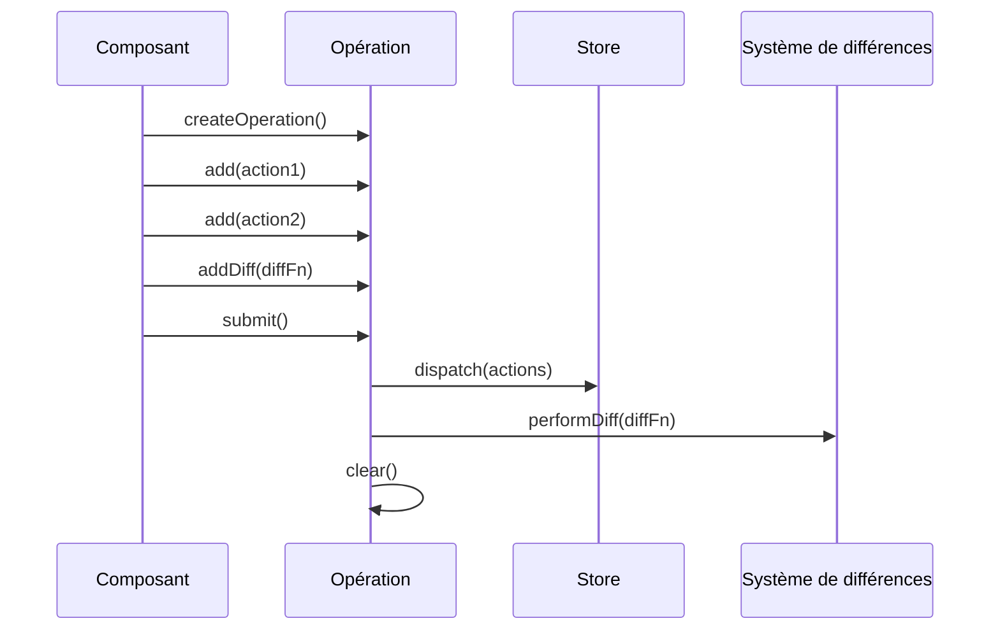

#### 3.2.3 Système d'historique

Le sous-dossier `state/history` gère l'historique des actions :

- **Reducer basé sur les actions** (`actionBasedReducer.ts`) : Implémente un reducer qui conserve l'historique des actions.
- **Actions d'historique** (`historyActions.ts`) : Définit les actions pour manipuler l'historique.
- **Reducer d'historique** (`historyReducer.ts`) : Implémente un reducer générique pour gérer l'historique des états.

```typescript
// Structure de l'état avec historique
interface HistoryState<S> {
  type: "normal" | "selection";
  list: Array<{
    state: S;
    name: string;
    modifiedRelated: boolean;
    allowIndexShift: boolean;
    diffs: Diff[];
  }>;
  index: number;
  indexDirection: -1 | 1;
  action: null | {
    id: string;
    state: S;
  };
}
```

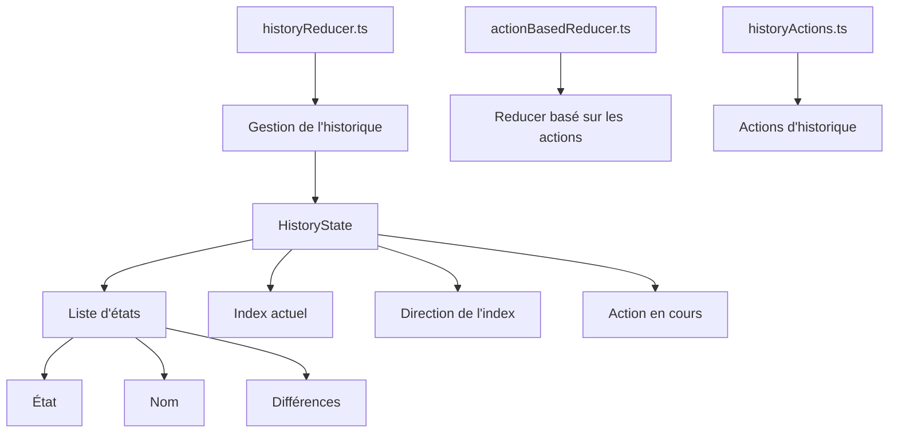

### 3.3 Système de menu contextuel (`contextMenu`)

#### 3.3.1 Structure et fonctionnalités

Le dossier `contextMenu` gère les menus contextuels de l'application :

- **Reducer de menu contextuel** (`contextMenuReducer.ts`) : Gère l'état des menus contextuels (ouverture, fermeture, options).
- **Actions de menu contextuel** (`contextMenuActions.ts`) : Définit les actions pour manipuler les menus contextuels.
- **Composant de menu contextuel** (`CustomContextMenu.tsx`) : Implémente l'interface utilisateur des menus contextuels.
- **Types de menu contextuel** (`contextMenuTypes.ts`) : Définit les types utilisés dans le système de menu contextuel.

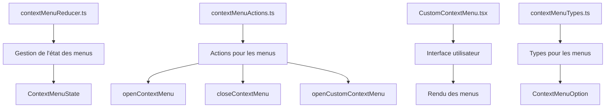

#### 3.3.2 Types principaux

```typescript
// Option d'action dans un menu contextuel
interface ContextMenuActionOption {
  label: string;
  onSelect: () => void;
  default?: boolean;
  icon?: React.ComponentType;
}

// Option de liste dans un menu contextuel
interface ContextMenuListOption {
  label: string;
  options: ContextMenuOption[];
  default?: boolean;
  icon?: React.ComponentType;
}

// État du menu contextuel
interface ContextMenuState {
  name: string;
  isOpen: boolean;
  options: ContextMenuOption[];
  position: Vec2;
  close: (() => void) | null;
  customContextMenu: null | OpenCustomContextMenuOptions;
}
```

### 3.4 Système de gestion de projet (`project`)

#### 3.4.1 Structure et fonctionnalités

Le dossier `project` gère les projets et les compositions :

- **Reducer de projet** (`projectReducer.ts`) : Gère l'état des projets (compositions, glisser-déposer).
- **Composants de projet** (`Project.tsx`, `ProjectComp.tsx`) : Implémentent l'interface utilisateur pour la gestion des projets.
- **Menu contextuel de projet** (`projectContextMenu.ts`) : Définit les options de menu contextuel spécifiques aux projets.

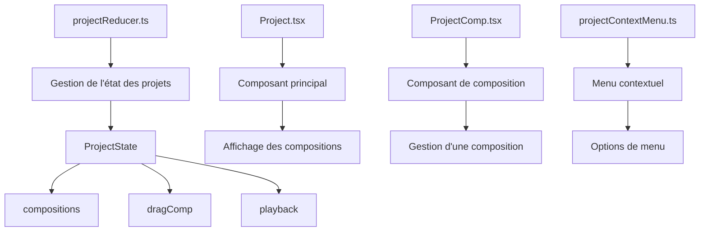

#### 3.4.2 Types principaux

```typescript
// État du projet
interface ProjectState {
  compositions: string[];
  dragComp: null | {
    compositionId: string;
    position: Vec2;
  };
  playback: null | {
    compositionId: number;
    frameIndex: number;
  };
}
```

### 3.5 Système de différences (`diff`)

#### 3.5.1 Structure et fonctionnalités

Le dossier `diff` gère les différences pour l'historique et les mises à jour visuelles :

- **Fabrique de différences** (`diffFactory.ts`) : Crée des objets de différence pour divers types de changements.
- **Types de différences** (`diffs.ts`) : Définit les différents types de différences possibles.
- **Filtrage et ajustement** : Contient des utilitaires pour filtrer et ajuster les différences.

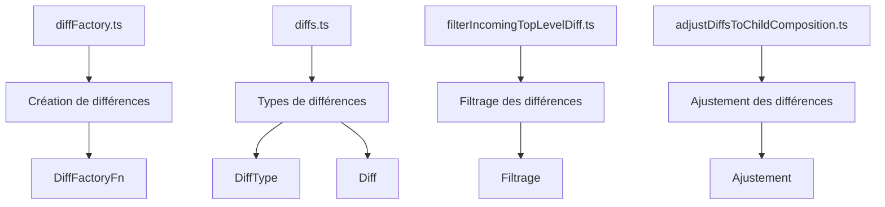

#### 3.5.2 Types principaux

```typescript
// Types de différences
enum DiffType {
  Layer,
  ModifyCompositionView,
  ModifyCompositionDimensions,
  AddLayer,
  RemoveLayer,
  ResizeAreas,
  FrameIndex,
  // ... autres types
}

// Structure d'une différence
interface Diff {
  type: DiffType;
  // ... autres propriétés spécifiques au type
}

// Fonction de création de différence
type DiffFactoryFn = (factory: typeof diffFactory) => Diff | Diff[];
```

### 3.6 Système de barre d'outils (`toolbar`)

#### 3.6.1 Structure et fonctionnalités

Le dossier `toolbar` gère les barres d'outils de l'application :

- **Reducer d'outils** (`toolReducer.ts`) : Gère l'état des outils sélectionnés.
- **Actions d'outils** (`toolActions.ts`) : Définit les actions pour manipuler les outils.
- **Composant de barre d'outils** (`Toolbar.tsx`) : Implémente l'interface utilisateur des barres d'outils.

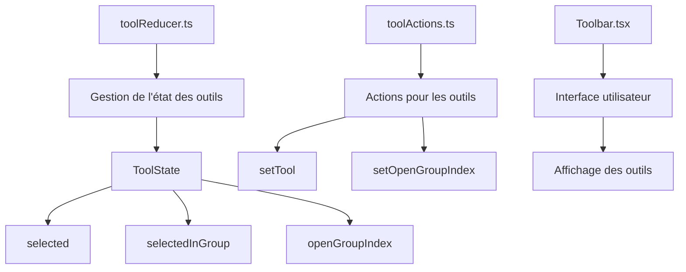

#### 3.6.2 Types principaux

```typescript
// État des outils
interface ToolState {
  selected: Tool;
  selectedInGroup: Array<Tool>;
  openGroupIndex: number;
}
```

### 3.7 Système d'écoute d'événements (`listener`)

#### 3.7.1 Structure et fonctionnalités

Le dossier `listener` gère les événements et les actions :

- **Demande d'action** (`requestAction.ts`) : Implémente un système sophistiqué pour demander et exécuter des actions.
- **Écoute de clavier** (`keyboard.ts`) : Gère les événements clavier.
- **Écoute de différences** (`diffListener.ts`) : Gère la propagation des différences aux abonnés.
- **Enregistrement d'écouteurs** (`registerListener.ts`) : Fournit un système pour enregistrer des écouteurs d'événements.

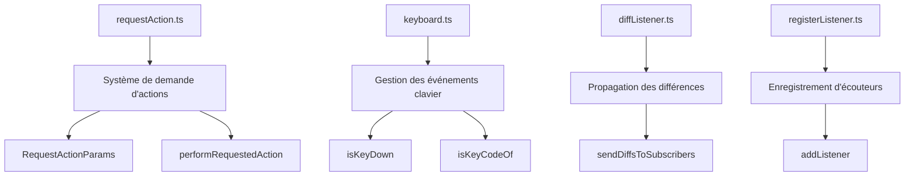

#### 3.7.2 Types principaux

```typescript
// Paramètres pour les demandes d'action
interface RequestActionParams {
  dispatch: (action: Action | Action[], ...otherActions: Action[]) => void;
  dispatchToAreaState: (areaId: string, action: Action) => void;
  cancelAction: () => void;
  submitAction: (name?: string, options?: Partial<SubmitOptions>) => void;
  addListener: typeof addListener;
  removeListener: typeof removeListener;
  execOnComplete: (callback: () => void) => void;
  done: () => boolean;
  addDiff: (fn: DiffFactoryFn, options?: { perform: boolean }) => void;
  performDiff: (fn: DiffFactoryFn) => void;
  addReverseDiff: (fn: DiffFactoryFn) => void;
}
```

## 4. Analyse du flux de données

### 4.1 Vue d'ensemble du flux de données

Le flux de données dans l'application suit principalement le modèle Redux avec quelques extensions personnalisées pour gérer des fonctionnalités spécifiques comme l'historique, les opérations complexes et les différences visuelles.

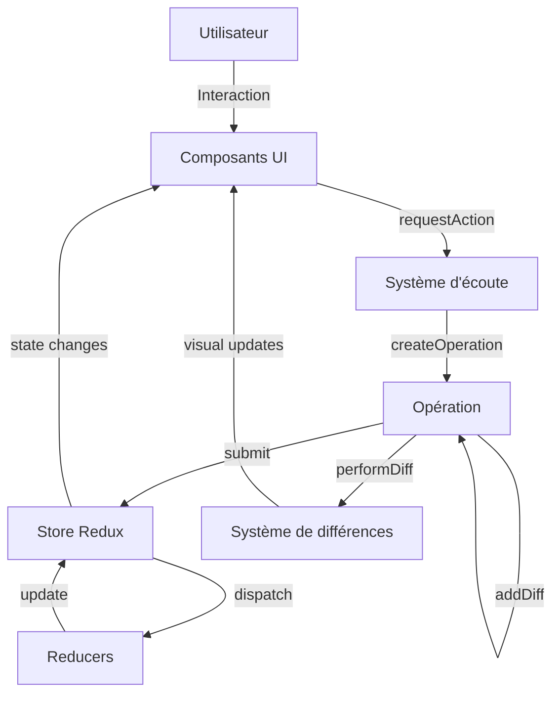

### 4.2 Points d'entrée et de sortie des données

#### 4.2.1 Points d'entrée

1. **Interactions utilisateur** : Les interactions utilisateur (clics, glisser-déposer, raccourcis clavier) sont capturées par les composants React et déclenchent des actions via le système `requestAction`.

2. **Système d'écoute d'événements** : Le module `listener` capture les événements DOM et les transforme en actions Redux via `requestAction.ts`.

3. **Opérations complexes** : Les opérations complexes sont initiées via `createOperation` qui permet de regrouper plusieurs actions et différences.

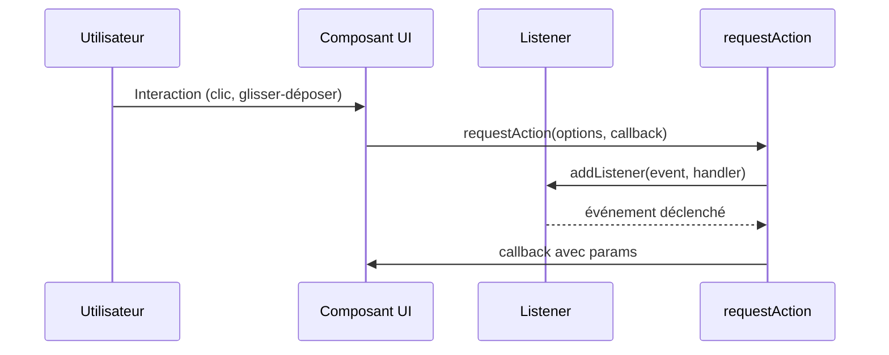

#### 4.2.2 Points de sortie

1. **Rendu des composants** : Les changements d'état sont reflétés dans l'interface utilisateur via le système de rendu de React.

2. **Système de différences** : Les différences visuelles sont propagées aux composants via le système `diffListener`.

3. **Persistance** : L'état est persisté via le système `saveState`.

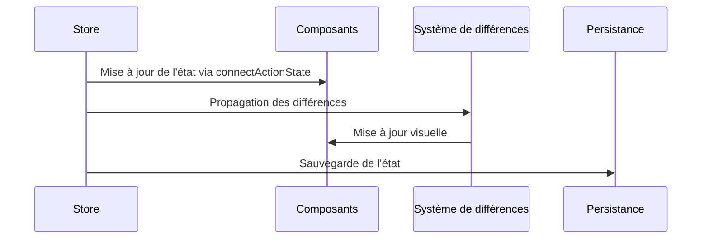

### 4.3 Modèles d'état (State Patterns)

#### 4.3.1 Structure à deux niveaux

L'application utilise une structure d'état à deux niveaux :

1. **ApplicationState** : L'état global de l'application, incluant l'historique.
2. **ActionState** : L'état actuel sans l'historique, utilisé pour les opérations courantes.

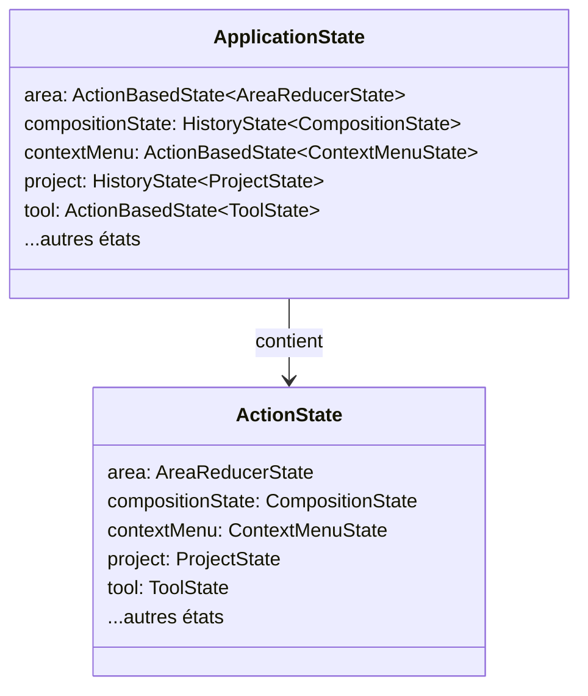

#### 4.3.2 Gestion de l'historique

L'historique est géré via deux types d'états :

1. **ActionBasedState** : État basé sur les actions, sans historique complet.
2. **HistoryState** : État avec historique complet, permettant l'annulation/rétablissement.

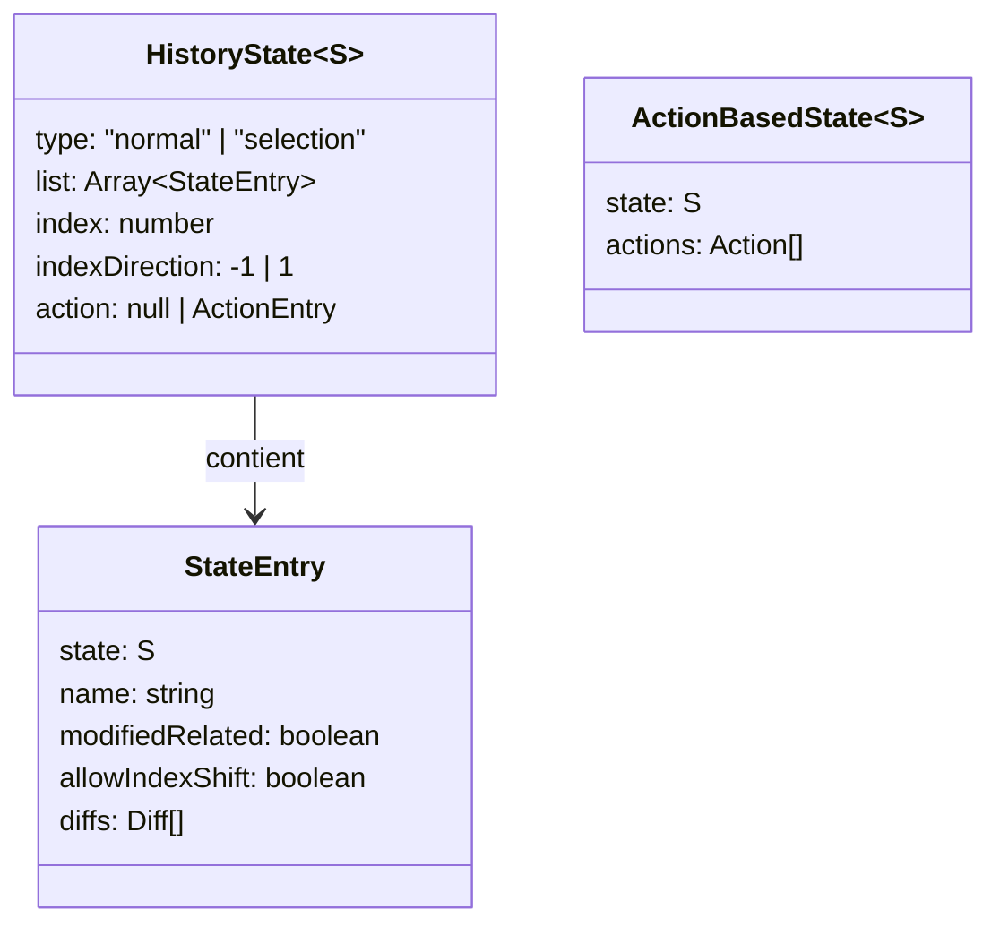

### 4.4 Flux de données pour les zones (Areas)

Le module `area` est central dans l'architecture et illustre bien le flux de données de l'application.

#### 4.4.1 Structure des zones

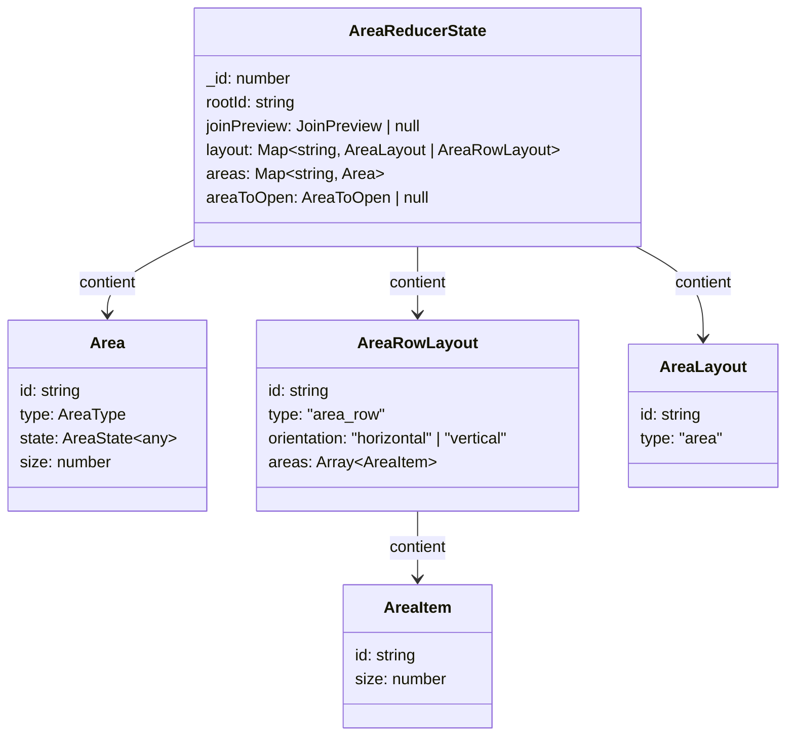

#### 4.4.2 Flux de données pour les opérations sur les zones

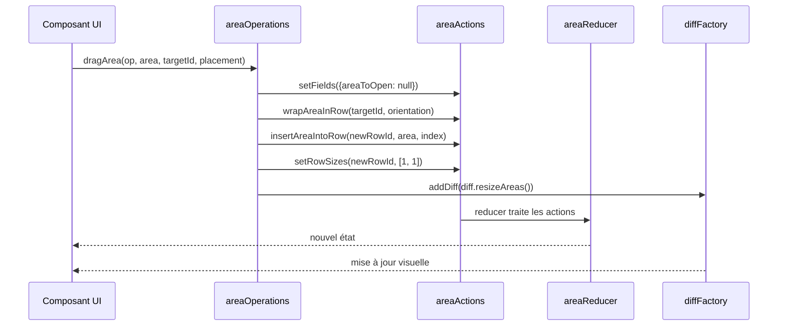

### 4.5 Flux de données pour les actions et opérations

Le système d'actions et d'opérations est au cœur du flux de données de l'application.

#### 4.5.1 Cycle de vie d'une action

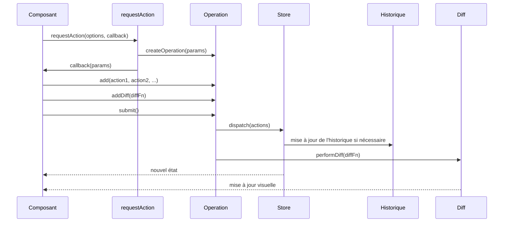

#### 4.5.2 Flux pour les opérations complexes

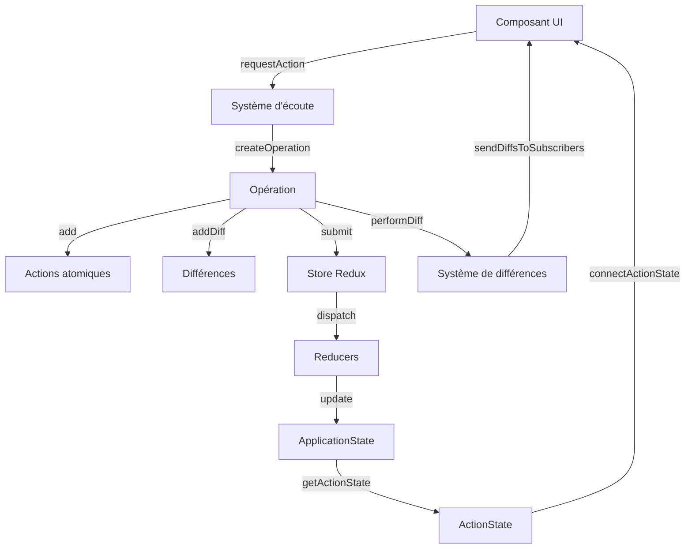

### 4.6 Flux de données pour le système de différences

Le système de différences permet de propager efficacement les changements visuels sans passer par le cycle complet de Redux.

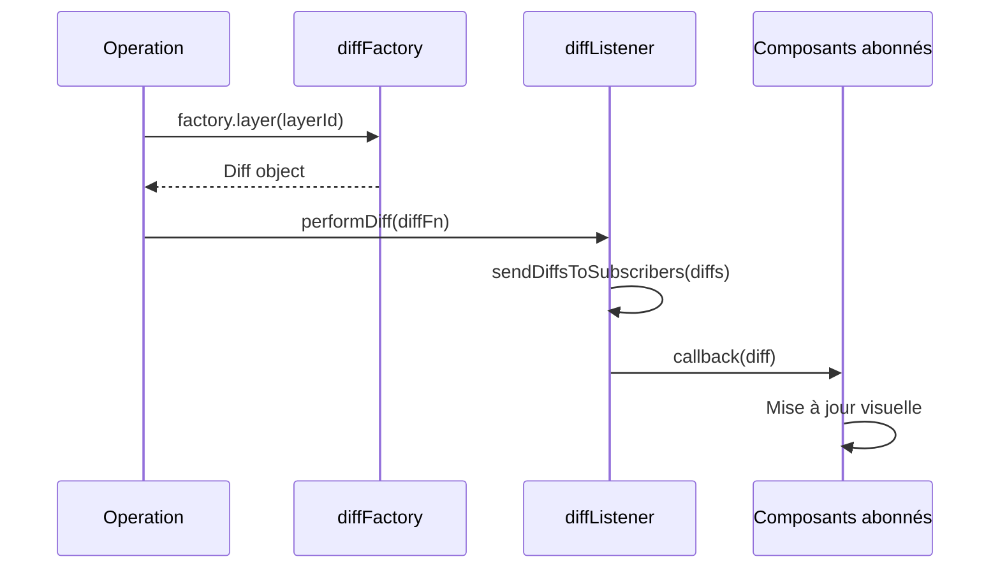

### 4.7 Analyse des modèles de communication

#### 4.7.1 Communication directe vs indirecte

L'application utilise principalement deux modèles de communication :

1. **Communication via Redux** : Pour les changements d'état qui doivent être persistés et inclus dans l'historique.
2. **Communication via le système de différences** : Pour les mises à jour visuelles rapides qui ne nécessitent pas de persistance.

```mermaid
graph TD
    A[Composant source] -->|Redux| B[Store]
    B -->|State| C[Composant cible]
    A -->|Diff| D[diffListener]
    D -->|Callback| C
```

#### 4.7.2 Modèle Publish-Subscribe

Le système `diffListener` implémente un modèle publish-subscribe où les composants peuvent s'abonner à des types spécifiques de différences.

```mermaid
classDiagram
    class DiffSubscriber {
        id: string
        callback: function
        types: DiffType[]
    }
    
    class DiffListener {
        subscribers: DiffSubscriber[]
        addSubscriber(callback, types): string
        removeSubscriber(id): void
        sendDiffsToSubscribers(diffs): void
    }
    
    DiffListener --> DiffSubscriber : gère
```

## 5. Points forts et limitations de l'architecture actuelle

### 5.1 Points forts

1. **Architecture modulaire** : Le système est divisé en modules distincts avec des responsabilités claires.
2. **Système d'historique avancé** : Le système d'historique permet une gestion fine des actions et des états.
3. **Opérations complexes** : Le système d'opérations permet de regrouper plusieurs actions et de maintenir la cohérence de l'état.
4. **Système de différences** : Le système de différences permet de propager efficacement les changements visuels.

### 5.2 Limitations et défis

1. **Complexité** : L'architecture actuelle est complexe et peut être difficile à comprendre et à maintenir.
2. **Couplage** : Certains modules sont fortement couplés, ce qui peut rendre la refactorisation plus difficile.
3. **Dépendances circulaires** : Il existe des dépendances circulaires potentielles entre certains modules.
4. **Duplication** : Certaines fonctionnalités peuvent être dupliquées dans différents modules.

```mermaid
quadrantChart
    title Points forts vs Complexité
    x-axis Faible complexité --> Forte complexité
    y-axis Faible valeur --> Forte valeur
    quadrant-1 À simplifier
    quadrant-2 À conserver et améliorer
    quadrant-3 À reconsidérer
    quadrant-4 À optimiser
    "Système d'historique": [0.8, 0.9]
    "Système d'opérations": [0.7, 0.8]
    "Système de différences": [0.6, 0.7]
    "Architecture modulaire": [0.5, 0.8]
    "Gestion des zones": [0.6, 0.6]
    "Menus contextuels": [0.4, 0.5]
    "Gestion des projets": [0.5, 0.6]
    "Système d'écoute d'événements": [0.7, 0.7]
```

## 6. Proposition d'architecture future

### 6.1 Structure du dossier 'core'

```mermaid
graph TD
    A[core] --> B[store]
    A --> C[components]
    A --> D[hooks]
    A --> E[utils]
    A --> F[types]
    B --> G[slices]
    B --> H[middleware]
    C --> I[area]
    C --> J[contextMenu]
    D --> K[useArea]
    D --> L[useContextMenu]
    D --> M[useOperation]
    E --> N[areaUtils]
    E --> O[diffUtils]
    F --> P[areaTypes]
    F --> Q[storeTypes]
```

### 6.2 Flux de données proposé

```mermaid
sequenceDiagram
    participant U as Utilisateur
    participant C as Composant UI
    participant H as Hooks
    participant S as Store
    participant M as Middleware
    
    U->>C: Interaction
    C->>H: useOperation()
    H->>S: dispatch(action)
    S->>M: Middleware (historique, diff)
    M->>S: Mise à jour de l'état
    S-->>C: Mise à jour via useSelector
```

## 7. Conclusion et recommandations

L'analyse de la structure actuelle du système de mise en page révèle une architecture sophistiquée mais complexe. La refactorisation devra préserver les points forts tout en simplifiant l'architecture et en réduisant le couplage entre les modules.

### 7.1 Recommandations pour la refactorisation

1. **Centraliser la gestion de l'état** : Créer un store Redux central avec des slices bien définis pour chaque domaine fonctionnel.
2. **Simplifier le système d'historique** : Utiliser redux-undo pour la gestion de l'historique tout en préservant les fonctionnalités avancées actuelles.
3. **Réduire le couplage** : Définir des interfaces claires entre les modules et minimiser les dépendances.
4. **Standardiser les patterns** : Adopter des patterns cohérents pour la gestion de l'état, les actions et les reducers.
5. **Documenter l'architecture** : Créer une documentation claire et détaillée de l'architecture pour faciliter la maintenance future.

### 7.2 Plan de migration

```mermaid
gantt
    title Plan de migration
    dateFormat  YYYY-MM-DD
    section Analyse
    Analyse de la structure actuelle      :done, a1, 2024-04-10, 7d
    Analyse du flux de données            :active, a2, after a1, 7d
    Analyse des performances              :a3, after a2, 7d
    section Conception
    Structure du dossier 'core'           :c1, after a3, 7d
    Conception du store Redux             :c2, after c1, 7d
    Système d'actions modulaire           :c3, after c2, 7d
    API de hooks                          :c4, after c3, 7d
    section Implémentation
    Refactorisation de la structure       :i1, after c4, 14d
    Implémentation du store Redux         :i2, after i1, 14d
    Système d'actions                     :i3, after i2, 14d
    Hooks et API publique                 :i4, after i3, 14d
    section Tests
    Tests unitaires                       :t1, after i4, 14d
    Documentation finale                  :t2, after t1, 14d
    Exemples d'utilisation                :t3, after t2, 7d
```

### 7.3 Prochaines étapes

La prochaine étape selon la feuille de route est l'analyse du flux de données (phase 1.2), qui comprendra :

1. Cartographier le flux de données entre les composants
2. Identifier les points d'entrée et de sortie des données
3. Documenter les modèles d'état actuels (state patterns)
4. Analyser comment les actions sont actuellement gérées
5. Créer des diagrammes de flux de données

Cette analyse permettra de mieux comprendre les interactions entre les composants et de concevoir une architecture plus cohérente et maintenable.
