# Core Concepts - Karmyc Core

## Overview

This document explains the fundamental concepts and architecture of Karmyc Core, a React-based layout management system.

## Architecture Overview

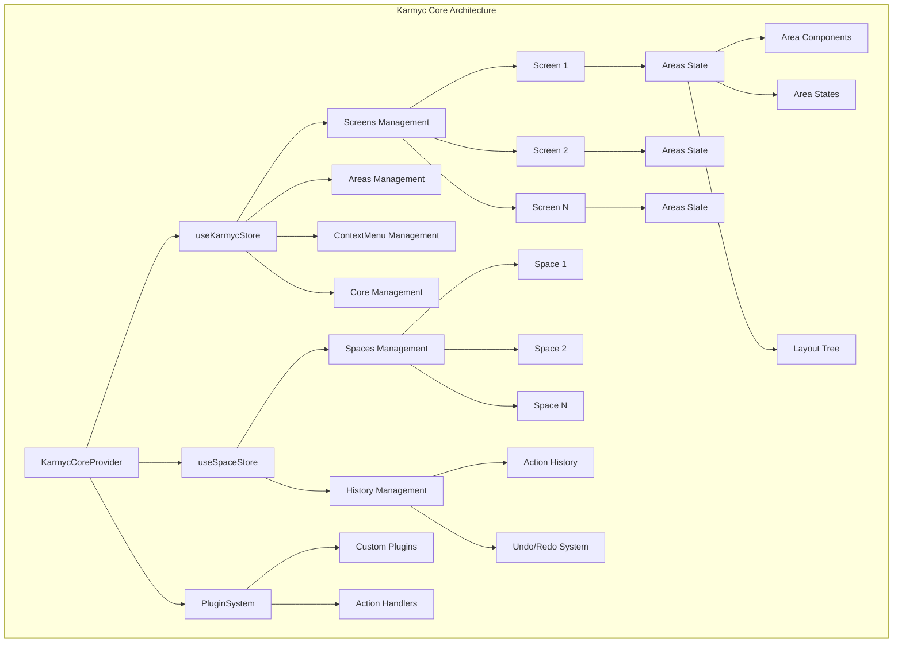

## Core Entities

### Screen
A top-level container representing a browser window or tab. Each screen contains its own areas and layout.

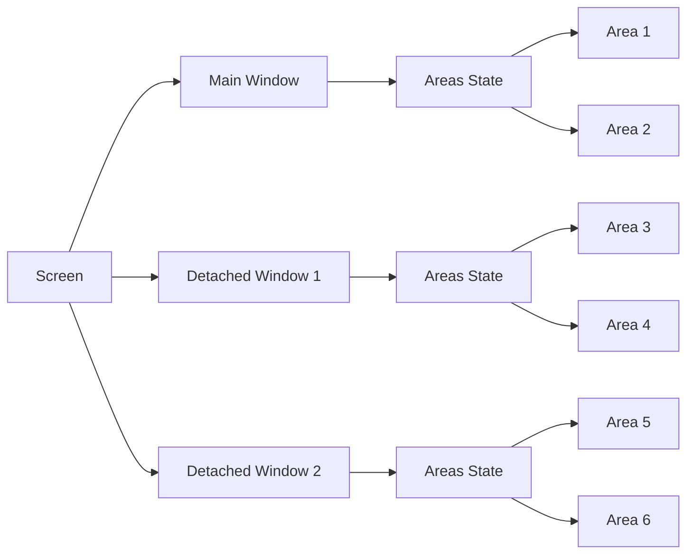

### Space
A workspace concept that contains shared state and history, independent of the visual layout. Spaces can be associated with areas across different screens.

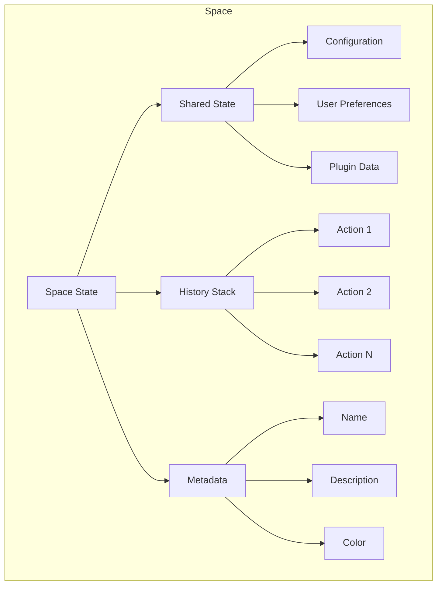

## Screens, Spaces, Areas, and Layouts

### Relationship Overview

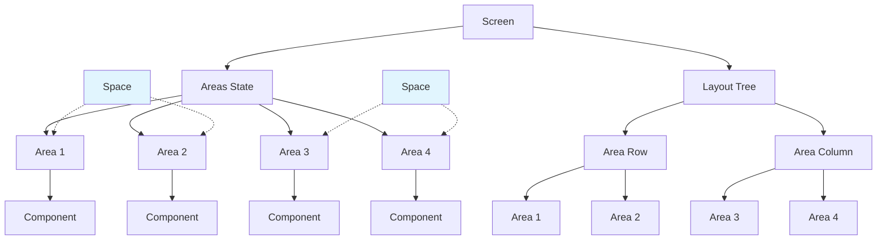

- **Screen**: A top-level container (main window or detached window) that contains areas and layout
- **Area**: A rectangular region that renders a specific React component, organized within a screen
- **Layout**: Tree structure of nested rows and columns defining area arrangement within a screen
- **Space**: A logical workspace concept that can be associated with areas (especially LEAD areas) for shared state and history

### Area
A rectangular region that renders a specific React component.

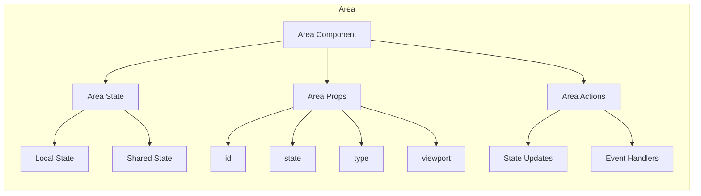

### Layout
A tree structure defining how areas are arranged on screen.

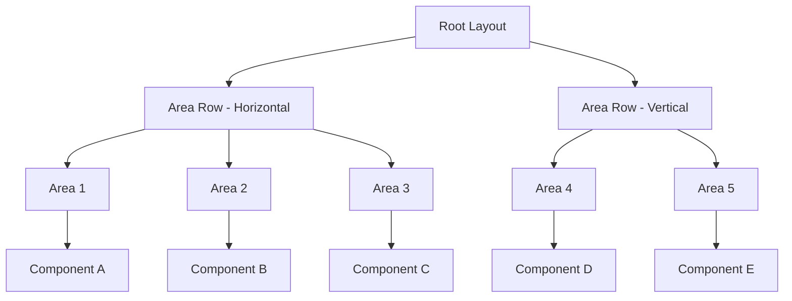

## State Management

### Zustand Store Structure

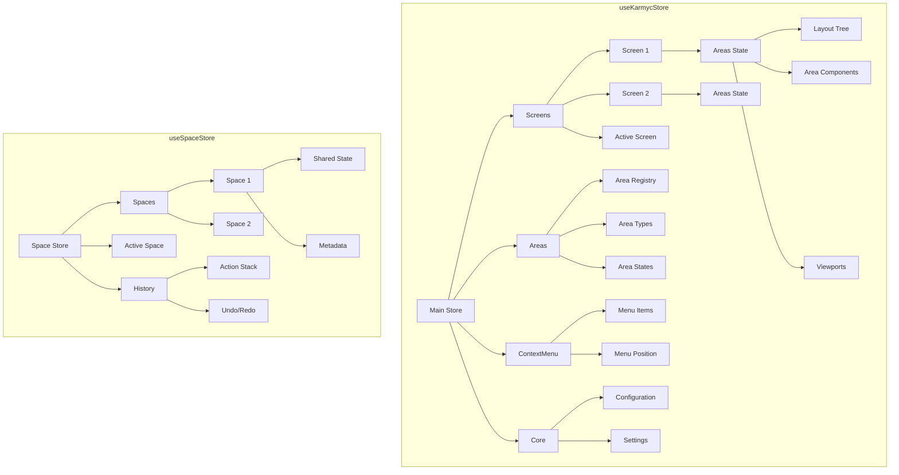

### Store Slices

The main store is divided into several slices:

1. **Screens Slice**: Manages multiple screens and their states
2. **Areas Slice**: Manages areas, their types, and layouts
3. **Context Menu Slice**: Manages context menu state and actions
4. **Core Slice**: Manages core configuration and settings

The space store manages:
1. **Spaces**: Workspace definitions and shared state
2. **History**: Action history for undo/redo functionality
3. **Active Space**: Currently active workspace

## Area Types and Registration

### Area Type System

Areas are typed components that can be registered with the system:

```typescript
interface AreaTypeOptions {
  displayName: string;
  role: AREA_ROLE;
  icon: React.ComponentType;
}

enum AREA_ROLE {
  LEAD = 'LEAD',      // Primary workspace areas
  FOLLOW = 'FOLLOW',  // Secondary areas that follow LEAD areas
  SELF = 'SELF'       // Independent areas
}
```

### Area Registration Flow

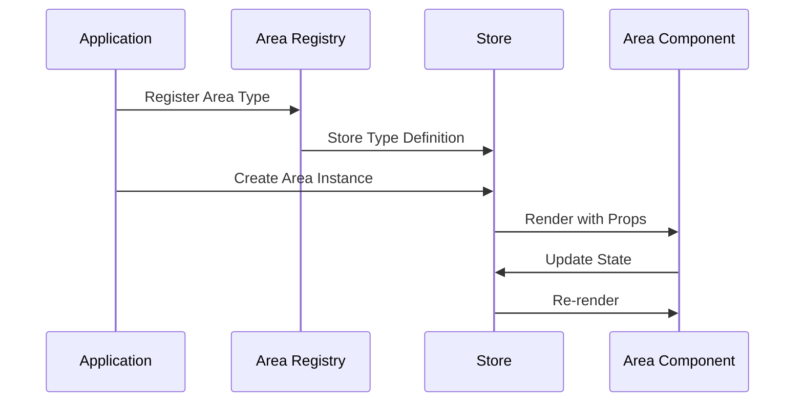

## Layout System

### Layout Tree Structure

Layouts are represented as a tree of nodes:

```typescript
interface LayoutNode {
  id: string;
  type: 'area' | 'area_row';
  orientation?: 'horizontal' | 'vertical';
  areas?: Array<{ id: string; size: number }>;
}
```

### Layout Operations

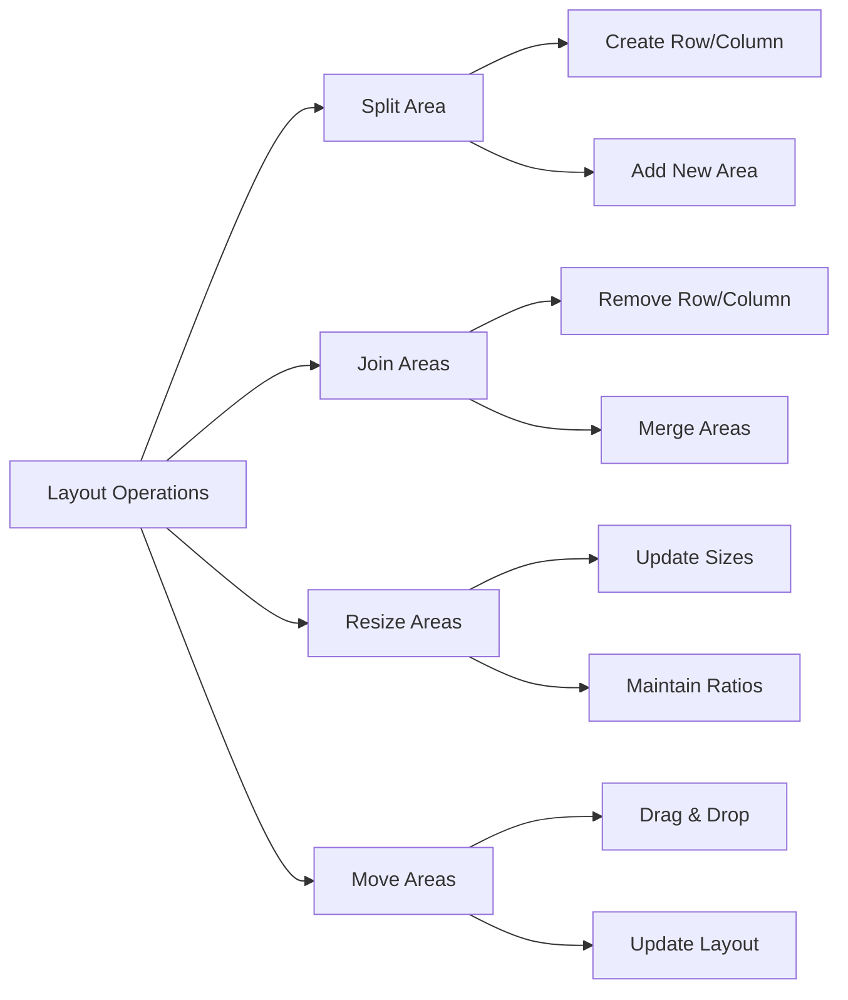

## Plugin System

### Plugin Architecture

Plugins can extend the system's functionality:

```typescript
interface IActionPlugin {
  id: string;
  name: string;
  onStoreChange?: (state: any, prevState: any) => void;
  onStoreInit?: (store: StoreApi<any>) => void;
  transformState?: (state: any) => Partial<any>;
  actions?: Record<string, (...args: any[]) => void>;
}
```

### Plugin Integration

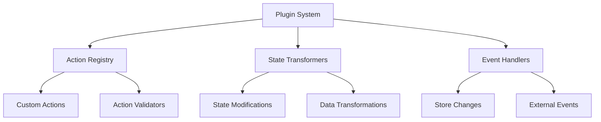

## Enhanced History System

### History Architecture

The enhanced history system provides sophisticated undo/redo functionality:

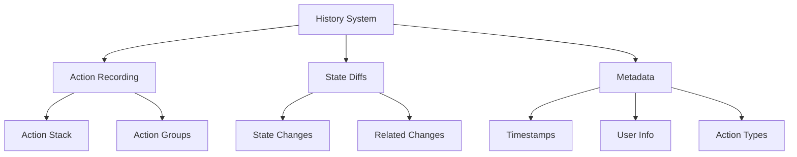

### History Actions

```typescript
interface EnhancedHistoryAction {
  id: string;
  name: string;
  timestamp: number;
  diffs: Diff[];
  state: any;
  allowIndexShift: boolean;
  modifiedRelated: boolean;
  metadata: {
    actionType: string;
    payload?: Record<string, any>;
    duration?: number;
  };
  indexDirection: -1 | 1;
}
```

## Multi-Screen Support

### Screen Management

Karmyc Core supports multiple screens with independent layouts:

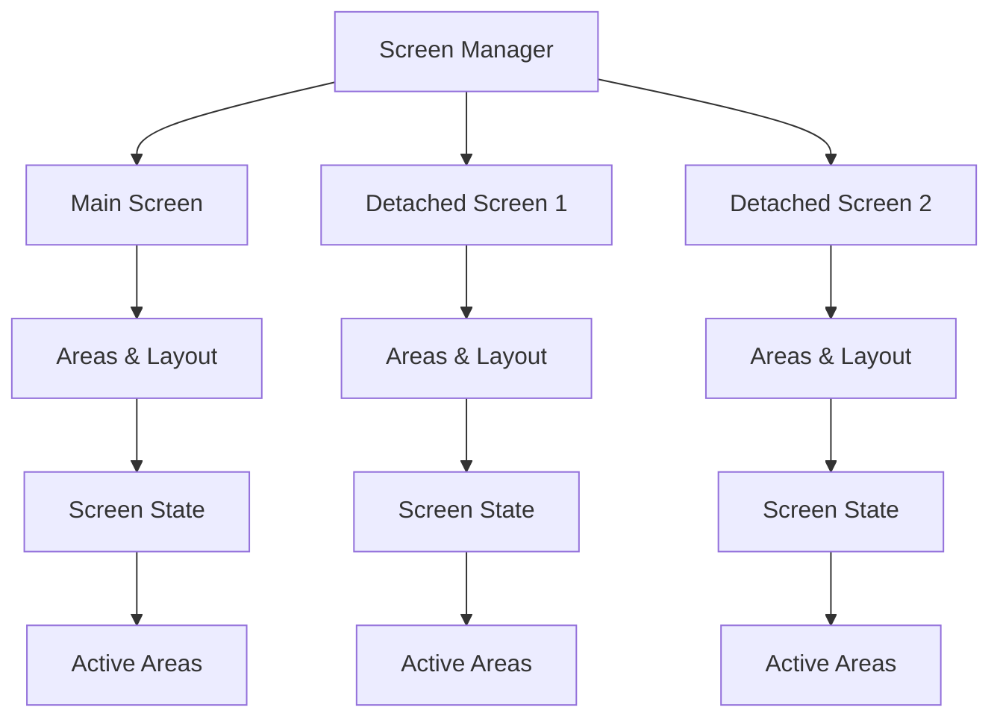

### Screen Operations

- **Create Screen**: Create a new detached window
- **Remove Screen**: Close a detached window
- **Switch Screen**: Change active screen
- **Sync State**: Synchronize state between screens

## Tools Slot System

### Slot Architecture

The tools slot system allows injecting components into predefined UI positions:

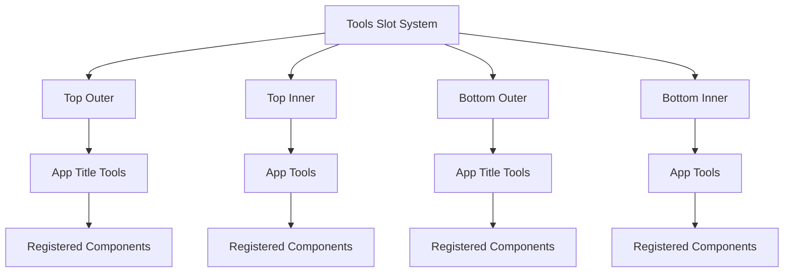

### Slot Types

- **apptitle**: Tools for the application title bar
- **app**: Tools for the main application area

### Slot Positions

- **top-outer**: Above the main content, outside the app area
- **top-inner**: Above the main content, inside the app area
- **bottom-outer**: Below the main content, outside the app area
- **bottom-inner**: Below the main content, inside the app area

## Drag and Drop System

### Drag and Drop Flow

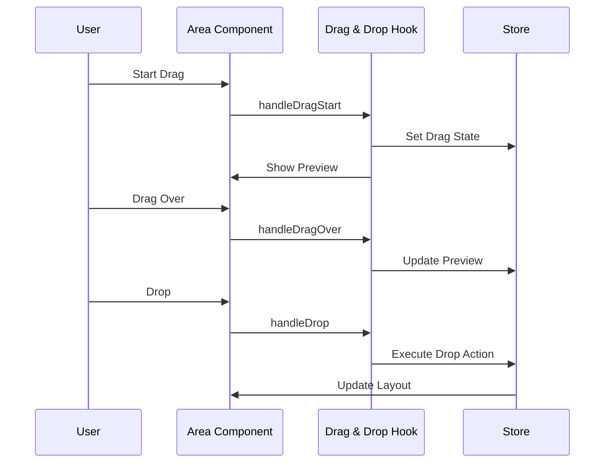

### Drop Zones

Drop zones are areas where dragged items can be dropped:

- **Area Joining**: Join two areas together
- **Area Splitting**: Split an area into multiple areas
- **Area Moving**: Move an area to a different position

## Context Menu System

### Context Menu Architecture

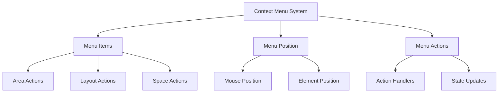

### Menu Types

- **Area Context Menu**: Actions for specific areas
- **Layout Context Menu**: Actions for layout management
- **Space Context Menu**: Actions for space management

## Error Handling

### Error Boundary System

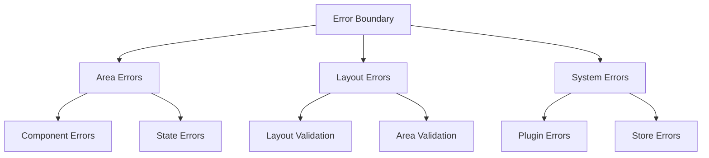

### Error Recovery

- **Area Error Boundary**: Catches errors in area components
- **Fallback Components**: Provides fallback UI for failed areas
- **Error Reporting**: Reports errors for debugging

## Performance Optimizations

### Optimization Strategies

1. **Memoization**: Components and hooks are memoized to prevent unnecessary re-renders
2. **Selective Updates**: Only affected areas are updated when state changes
3. **Lazy Loading**: Area components are loaded on demand
4. **Viewport Culling**: Only visible areas are rendered

### Performance Monitoring

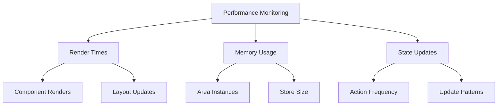
