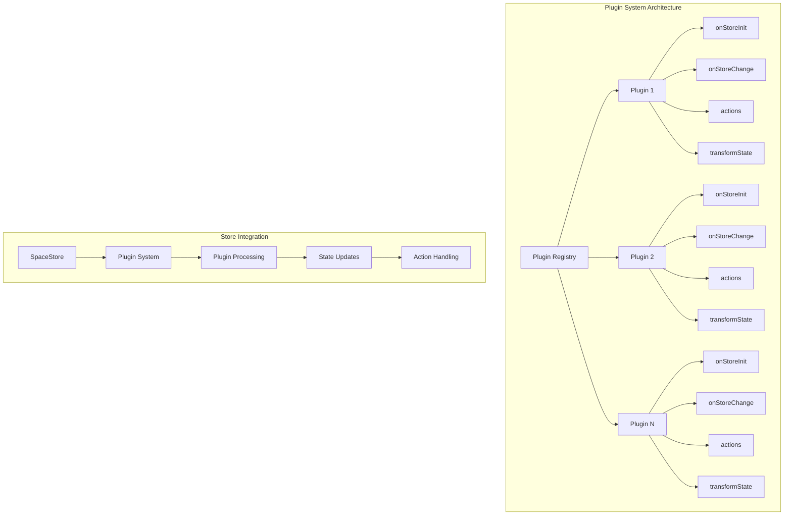
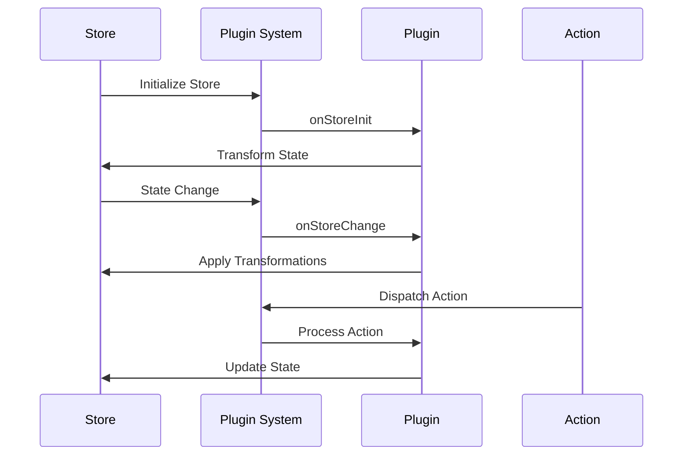

# Plugin System Guide - Karmyc Core

## Overview

The plugin system in Karmyc Core allows you to extend the functionality of the store without modifying the original source code. Plugins can add custom properties, actions, and behaviors to the space store in a modular and reusable way.

## Plugin Architecture



## Plugin Interface

```typescript
interface ZustandPlugin<T> {
  name: string;                                    // Unique plugin name
  onStoreChange?: (state: T, prevState: T) => void; // Called on every state change
  onStoreInit?: (store: StoreApi<T>) => void;      // Called at initialization
  transformState?: (state: T) => Partial<T>;       // Transforms the state
  actions?: Record<string, (...args: any[]) => void>; // Custom actions
}
```

## Plugin Lifecycle



## Creating Plugins

### Basic Plugin Structure

```typescript
import { ZustandPlugin } from '@gamesberry/karmyc-core';
import { SpaceStateType } from '../core/spaceStore';

const myPlugin: ZustandPlugin<SpaceStateType> = {
  name: 'my-plugin',
  
  // Initialization (called once at startup)
  onStoreInit: (store) => {
    console.log('My plugin initialized');
    // Add default properties to existing spaces
  },
  
  // Custom actions
  actions: {
    'MY_ACTION': (payload: any) => {
      // Your action logic
      console.log('Action executed:', payload);
    }
  }
};
```

### Using Plugins

```typescript
import { usePluginSystem } from '@gamesberry/karmyc-core';
import { useSpaceStore } from '../core/spaceStore';

function MyComponent() {
  const spaceStore = useSpaceStore;
  
  // Initialize the plugin
  const pluginSystem = usePluginSystem(spaceStore, [myPlugin]);
  
  // Use the store normally
  const spaces = spaceStore.getState().spaces;
  
  return (
    <div>
      <h2>My component with plugin</h2>
      {/* Your user interface */}
    </div>
  );
}
```

## Plugin Examples

### 1. View Counter Plugin

```typescript
const spaceViewCounterPlugin: ZustandPlugin<SpaceStateType> = {
  name: 'space-view-counter',
  
  onStoreInit: (store) => {
    // Add view counter to all spaces
    const state = store.getState();
    const updatedSpaces = { ...state.spaces };
    
    Object.keys(updatedSpaces).forEach(spaceId => {
      const space = updatedSpaces[spaceId];
      if (!space.sharedState.payload) {
        space.sharedState.payload = { viewCount: 0 };
      }
    });
    
    store.setState({ spaces: updatedSpaces });
  },
  
  actions: {
    'INCREMENT_VIEW_COUNT': (payload: { spaceId: string }) => {
      const store = useSpaceStore.getState();
      const space = store.spaces[payload.spaceId];
      
      if (space) {
        const payload = space.sharedState.payload as any;
        payload.viewCount = (payload.viewCount || 0) + 1;
        useSpaceStore.setState({ spaces: { ...store.spaces } });
      }
    }
  }
};
```

### 2. Tags System Plugin

```typescript
const spaceTagsPlugin: ZustandPlugin<SpaceStateType> = {
  name: 'space-tags',
  
  onStoreInit: (store) => {
    // Initialize tags for existing spaces
    const state = store.getState();
    const updatedSpaces = { ...state.spaces };
    
    Object.keys(updatedSpaces).forEach(spaceId => {
      const space = updatedSpaces[spaceId];
      if (!space.sharedState.payload) {
        space.sharedState.payload = { tags: [] };
      }
    });
    
    store.setState({ spaces: updatedSpaces });
  },
  
  actions: {
    'ADD_SPACE_TAG': (payload: { spaceId: string; tag: string; color?: string }) => {
      const store = useSpaceStore.getState();
      const space = store.spaces[payload.spaceId];
      
      if (space) {
        const spacePayload = space.sharedState.payload as any;
        const tags = spacePayload.tags || [];
        spacePayload.tags = [...tags, { name: payload.tag, color: payload.color }];
        useSpaceStore.setState({ spaces: { ...store.spaces } });
      }
    },
    
    'REMOVE_SPACE_TAG': (payload: { spaceId: string; tagName: string }) => {
      const store = useSpaceStore.getState();
      const space = store.spaces[payload.spaceId];
      
      if (space) {
        const spacePayload = space.sharedState.payload as any;
        const tags = spacePayload.tags || [];
        spacePayload.tags = tags.filter((t: any) => t.name !== payload.tagName);
        useSpaceStore.setState({ spaces: { ...store.spaces } });
      }
    }
  }
};
```

### 3. Statistics Plugin

```typescript
const spaceStatsPlugin: ZustandPlugin<SpaceStateType> = {
  name: 'space-stats',
  
  onStoreInit: (store) => {
    console.log('Statistics plugin initialized');
    // Add default properties to existing spaces
  },
  
  onStoreChange: (newState, prevState) => {
    // Increment modification counter
    Object.keys(newState.spaces).forEach(spaceId => {
      const newSpace = newState.spaces[spaceId];
      const prevSpace = prevState.spaces[spaceId];
      
      if (newSpace !== prevSpace) {
        const payload = newSpace.sharedState.payload as any;
        payload.modificationCount = (payload.modificationCount || 0) + 1;
      }
    });
  },
  
  actions: {
    'RESET_SPACE_STATS': (payload: { spaceId: string }) => {
      const store = useSpaceStore.getState();
      const space = store.spaces[payload.spaceId];
      
      if (space) {
        const payload = space.sharedState.payload as any;
        payload.modificationCount = 0;
        useSpaceStore.setState({ spaces: { ...store.spaces } });
      }
    },
    
    'GET_SPACE_STATS': (payload: { spaceId: string }) => {
      const store = useSpaceStore.getState();
      const space = store.spaces[payload.spaceId];
      
      if (space) {
        const payload = space.sharedState.payload as any;
        return {
          modificationCount: payload.modificationCount || 0,
          lastModified: payload.lastModified || null
        };
      }
      return null;
    }
  }
};
```

### 4. Theme Plugin

```typescript
const themePlugin: ZustandPlugin<SpaceStateType> = {
  name: 'theme-plugin',
  
  onStoreInit: (store) => {
    // Initialize theme for all spaces
    const state = store.getState();
    const updatedSpaces = { ...state.spaces };
    
    Object.keys(updatedSpaces).forEach(spaceId => {
      const space = updatedSpaces[spaceId];
      if (!space.sharedState.payload) {
        space.sharedState.payload = { theme: 'light' };
      }
    });
    
    store.setState({ spaces: updatedSpaces });
  },
  
  transformState: (state) => {
    // Transform state to include theme information
    const transformedSpaces = { ...state.spaces };
    
    Object.keys(transformedSpaces).forEach(spaceId => {
      const space = transformedSpaces[spaceId];
      const payload = space.sharedState.payload as any;
      const theme = payload?.theme || 'light';
      
      // Add theme-specific properties
      space.theme = theme;
      space.themeColors = theme === 'dark' ? darkColors : lightColors;
    });
    
    return { spaces: transformedSpaces };
  },
  
  actions: {
    'SET_SPACE_THEME': (payload: { spaceId: string; theme: 'light' | 'dark' }) => {
      const store = useSpaceStore.getState();
      const space = store.spaces[payload.spaceId];
      
      if (space) {
        const spacePayload = space.sharedState.payload as any;
        spacePayload.theme = payload.theme;
        useSpaceStore.setState({ spaces: { ...store.spaces } });
      }
    }
  }
};

const lightColors = {
  background: '#ffffff',
  text: '#000000',
  primary: '#007bff'
};

const darkColors = {
  background: '#1a1a1a',
  text: '#ffffff',
  primary: '#4dabf7'
};
```

## Advanced Plugin Features

### State Transformation

```typescript
const stateTransformPlugin: ZustandPlugin<SpaceStateType> = {
  name: 'state-transform',
  
  transformState: (state) => {
    // Add computed properties to the state
    const transformedState = { ...state };
    
    // Add computed properties
    transformedState.totalSpaces = Object.keys(state.spaces).length;
    transformedState.activeSpaces = Object.values(state.spaces).filter(
      space => space.sharedState.payload?.isActive
    ).length;
    
    return transformedState;
  }
};
```

### Action Interception

```typescript
const actionInterceptorPlugin: ZustandPlugin<SpaceStateType> = {
  name: 'action-interceptor',
  
  onStoreChange: (newState, prevState) => {
    // Intercept and log all state changes
    console.log('State changed:', {
      from: prevState,
      to: newState,
      timestamp: new Date().toISOString()
    });
  },
  
  actions: {
    'LOG_ACTION': (payload: { action: string; data: any }) => {
      console.log('Action logged:', payload);
    }
  }
};
```

### Conditional Plugin Loading

```typescript
const conditionalPlugin: ZustandPlugin<SpaceStateType> = {
  name: 'conditional-plugin',
  
  onStoreInit: (store) => {
    // Only initialize if certain conditions are met
    const state = store.getState();
    
    if (process.env.NODE_ENV === 'development') {
      console.log('Development plugin initialized');
      // Add development-specific features
    }
  },
  
  onStoreChange: (newState, prevState) => {
    // Only process changes in development
    if (process.env.NODE_ENV === 'development') {
      // Development-specific change handling
    }
  }
};
```

## Plugin Management

### Plugin Registration

```typescript
// plugins/index.ts
import { spaceViewCounterPlugin } from './spaceViewCounterPlugin';
import { spaceTagsPlugin } from './spaceTagsPlugin';
import { spaceStatsPlugin } from './spaceStatsPlugin';
import { themePlugin } from './themePlugin';

export const allPlugins = [
  spaceViewCounterPlugin,
  spaceTagsPlugin,
  spaceStatsPlugin,
  themePlugin
];

export const developmentPlugins = [
  ...allPlugins,
  actionInterceptorPlugin
];
```

### Dynamic Plugin Loading

```typescript
import { usePluginSystem } from '@gamesberry/karmyc-core';
import { useSpaceStore } from '../core/spaceStore';

function App() {
  const spaceStore = useSpaceStore;
  const [plugins, setPlugins] = useState([]);
  
  useEffect(() => {
    // Load plugins based on configuration
    const loadPlugins = async () => {
      const config = await fetch('/api/plugins');
      const pluginConfig = await config.json();
      
      const activePlugins = pluginConfig.enabled.map(name => 
        allPlugins.find(p => p.name === name)
      ).filter(Boolean);
      
      setPlugins(activePlugins);
    };
    
    loadPlugins();
  }, []);
  
  const pluginSystem = usePluginSystem(spaceStore, plugins);
  
  return (
    <div>
      {/* Your app content */}
    </div>
  );
}
```

## Plugin Best Practices

### 1. Naming Conventions

```typescript
// Use descriptive names
const spaceAnalyticsPlugin = { name: 'space-analytics' };
const userPreferencesPlugin = { name: 'user-preferences' };
const performanceMonitorPlugin = { name: 'performance-monitor' };
```

### 2. Error Handling

```typescript
const safePlugin: ZustandPlugin<SpaceStateType> = {
  name: 'safe-plugin',
  
  onStoreInit: (store) => {
    try {
      // Plugin initialization logic
      console.log('Plugin initialized successfully');
    } catch (error) {
      console.error('Plugin initialization failed:', error);
    }
  },
  
  onStoreChange: (newState, prevState) => {
    try {
      // State change handling
    } catch (error) {
      console.error('Plugin state change handling failed:', error);
    }
  }
};
```

### 3. Performance Considerations

```typescript
const performanceOptimizedPlugin: ZustandPlugin<SpaceStateType> = {
  name: 'performance-optimized',
  
  onStoreChange: (newState, prevState) => {
    // Only process changes when necessary
    if (newState.spaces !== prevState.spaces) {
      // Process space changes
    }
    
    if (newState.activeSpaceId !== prevState.activeSpaceId) {
      // Process active space changes
    }
  }
};
```

### 4. Plugin Dependencies

```typescript
const dependentPlugin: ZustandPlugin<SpaceStateType> = {
  name: 'dependent-plugin',
  
  onStoreInit: (store) => {
    // Check if required plugins are available
    const state = store.getState();
    const requiredPlugin = state.plugins?.find(p => p.name === 'required-plugin');
    
    if (!requiredPlugin) {
      console.warn('Dependent plugin requires "required-plugin" to be loaded');
      return;
    }
    
    // Initialize dependent plugin
  }
};
```

## Testing Plugins

### Unit Testing

```typescript
// __tests__/plugins/spaceViewCounterPlugin.test.ts
import { spaceViewCounterPlugin } from '../plugins/spaceViewCounterPlugin';

describe('Space View Counter Plugin', () => {
  let mockStore: any;
  
  beforeEach(() => {
    mockStore = {
      getState: jest.fn(),
      setState: jest.fn()
    };
  });
  
  it('initializes with view counter', () => {
    mockStore.getState.mockReturnValue({
      spaces: {
        'space-1': { sharedState: { payload: {} } }
      }
    });
    
    spaceViewCounterPlugin.onStoreInit?.(mockStore);
    
    expect(mockStore.setState).toHaveBeenCalledWith(
      expect.objectContaining({
        spaces: expect.objectContaining({
          'space-1': expect.objectContaining({
            sharedState: expect.objectContaining({
              payload: expect.objectContaining({
                viewCount: 0
              })
            })
          })
        })
      })
    );
  });
  
  it('increments view count', () => {
    const action = spaceViewCounterPlugin.actions?.['INCREMENT_VIEW_COUNT'];
    expect(action).toBeDefined();
    
    // Test action execution
    action?.({ spaceId: 'space-1' });
  });
});
```

### Integration Testing

```typescript
// __tests__/plugins/integration.test.ts
import { render } from '@testing-library/react';
import { usePluginSystem } from '@gamesberry/karmyc-core';
import { spaceViewCounterPlugin } from '../plugins/spaceViewCounterPlugin';

describe('Plugin Integration', () => {
  it('loads and initializes plugins correctly', () => {
    const TestComponent = () => {
      const pluginSystem = usePluginSystem(mockStore, [spaceViewCounterPlugin]);
      return <div>Plugin loaded</div>;
    };
    
    render(<TestComponent />);
    
    // Add assertions for plugin initialization
  });
});
```

## Troubleshooting

### Common Issues

1. **Plugin not initializing**: Check if the plugin is properly registered in the plugin array
2. **State not updating**: Verify the plugin's action handlers are correctly implemented
3. **Performance issues**: Ensure plugins don't cause unnecessary re-renders
4. **Conflicting plugins**: Check for naming conflicts or overlapping functionality

### Debug Tools

```typescript
const debugPlugin: ZustandPlugin<SpaceStateType> = {
  name: 'debug-plugin',
  
  onStoreInit: (store) => {
    console.log('Debug plugin initialized');
    console.log('Initial state:', store.getState());
  },
  
  onStoreChange: (newState, prevState) => {
    console.log('State change detected:', {
      from: prevState,
      to: newState,
      diff: getStateDiff(prevState, newState)
    });
  }
};

function getStateDiff(prevState: any, newState: any) {
  // Simple state diff implementation
  return Object.keys(newState).reduce((diff, key) => {
    if (prevState[key] !== newState[key]) {
      diff[key] = { from: prevState[key], to: newState[key] };
    }
    return diff;
  }, {} as any);
}
``` 
