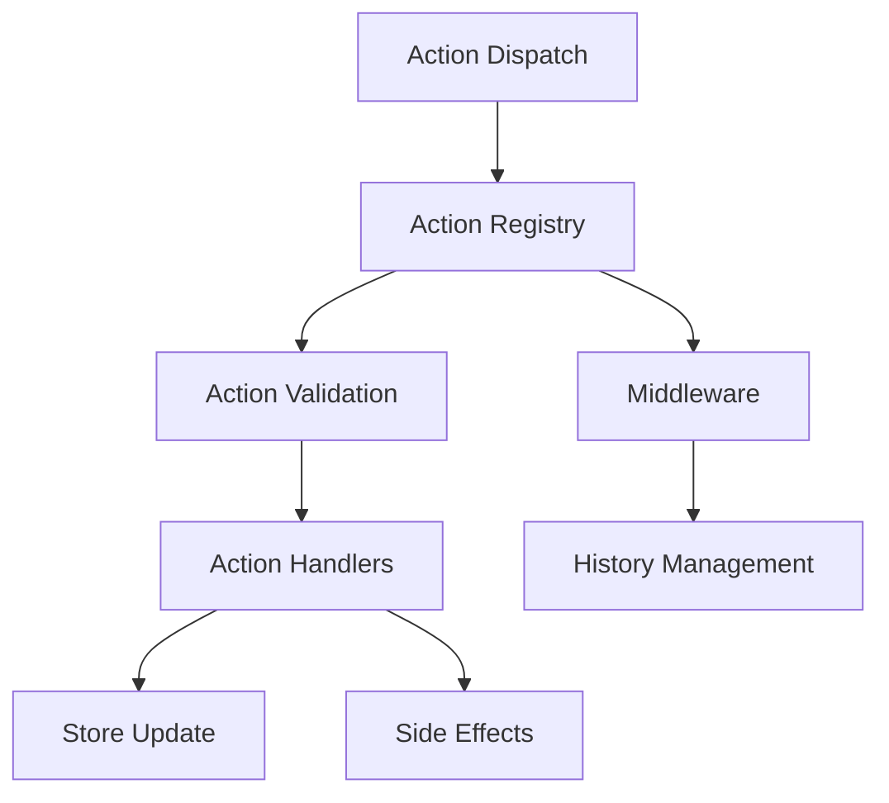

# Action System Architecture

This document provides an overview of the action system used in Karmyc Core, covering its design, components, and integration with Redux.

## Overview

Karmyc Core uses a modular action system based on a plugin architecture that allows registering action handlers with different priorities. It is integrated with Redux Toolkit and provides React hooks for easy use.



## Core Components

### Action Types

```typescript
// Core action types used in the system
import { AnyAction } from '@reduxjs/toolkit';

export type TActionHandler<T extends AnyAction = AnyAction> = (action: T) => void;

export interface IActionPlugin<T extends AnyAction = AnyAction> {
  id: string;
  priority: number;
  actionTypes: string[] | null; // null means all action types
  handler: TActionHandler<T>;
}

export interface IActionValidationResult {
  valid: boolean;
  message?: string;
}

export type TActionValidator<T extends AnyAction = AnyAction> = 
  (action: T) => IActionValidationResult;
```

### Action Registry

The action registry is the central component that manages action plugins and validators:

```typescript
class ActionRegistry {
  // Registers an action plugin
  registerPlugin<T extends AnyAction>(plugin: IActionPlugin<T>): void;
  
  // Unregisters an action plugin by its ID
  unregisterPlugin(id: string): void;
  
  // Registers a validator for a specific action type
  registerValidator<T extends AnyAction>(
    actionType: string, 
    validator: TActionValidator<T>
  ): void;
  
  // Validates an action using registered validators
  validateAction(action: AnyAction): IActionValidationResult;
  
  // Handles an action by sending it to all relevant plugins
  handleAction(action: AnyAction): void;
}
```

### Redux Middleware

The action system is integrated with Redux through middleware:

```typescript
export const actionsMiddleware: Middleware = store => next => action => {
  // Execute the action normally in Redux
  const result = next(action);
  
  // Notify the action registry
  actionRegistry.handleAction(action);
  
  return result;
};
```

## Priority System

The priority system controls the execution order of action plugins. Plugins with higher priority are executed first.

```typescript
export enum ActionPriority {
  CRITICAL = 1000,  // Critical actions (security, validation)
  HIGH = 800,       // Important actions (history, logging)
  NORMAL = 500,     // Standard actions
  LOW = 200,        // Low priority actions (analytics, etc.)
  BACKGROUND = 100  // Background actions
}
```

## Validation Mechanism

The validation system verifies that an action is valid before executing it. Each action type can have multiple validators.

```typescript
// Common validators
export const hasPayload: TActionValidator = (action: AnyAction) => {
  if (!action.payload) {
    return {
      valid: false,
      message: `Action ${action.type} has no payload`
    };
  }
  return { valid: true };
};

export const hasRequiredFields = (fields: string[]): TActionValidator => {
  return (action: AnyAction) => {
    for (const field of fields) {
      if (action.payload && action.payload[field] === undefined) {
        return {
          valid: false,
          message: `Action ${action.type} missing required field: ${field}`
        };
      }
    }
    return { valid: true };
  };
};
```

## React Hooks

The action system provides React hooks for easy integration:

```typescript
// Hook to register an action plugin
export function useActionPlugin<T extends AnyAction = AnyAction>(
  id: string,
  priority: number,
  actionTypes: string[] | null,
  handler: TActionHandler<T>
): void;

// Hook to register an action validator
export function useActionValidator<T extends AnyAction = AnyAction>(
  actionType: string,
  validator: (action: T) => { valid: boolean; message?: string }
): void;
```

## History Integration

The action system integrates with the history system to enable undo/redo functionality:

```typescript
export const historyPlugin: IActionPlugin = {
  id: 'history',
  priority: ActionPriority.HIGH,
  actionTypes: [
    'area/addArea',
    'area/removeArea',
    'area/updateArea',
    // Other action types...
  ],
  handler: (action: AnyAction) => {
    // Logic to record the action in history
    console.log(`Action recorded in history: ${action.type}`);
  }
};
```

## Usage Examples

### Registering an Action Plugin

```typescript
function MyComponent() {
  useActionPlugin(
    'my-plugin',
    ActionPriority.NORMAL,
    ['area/addArea', 'area/removeArea'],
    (action) => {
      console.log('Action intercepted:', action);
      // Custom logic...
    }
  );
  
  // Rest of the component...
}
```

### Registering an Action Validator

```typescript
function MyComponent() {
  useActionValidator(
    'area/addArea',
    hasRequiredFields(['id', 'type'])
  );
  
  // Rest of the component...
}
```

### Dispatching an Action

```typescript
function MyComponent() {
  const dispatch = useAppDispatch();
  
  const handleAddArea = () => {
    // The action will be validated by the action system
    dispatch(addArea({ id: 'area-1', type: 'editor' }));
  };
  
  // Rest of the component...
}
```

## Performance Considerations

The action system follows these principles to ensure good performance:

1. **Plugins sorted by priority**: Plugins are sorted once during registration, not for each action.
2. **Filtering by action type**: Plugins are called only for the action types they handle.
3. **Early validation**: Validation is performed before executing handlers to avoid unnecessary processing.
4. **Error handling**: Errors in one plugin do not affect other plugins. 
