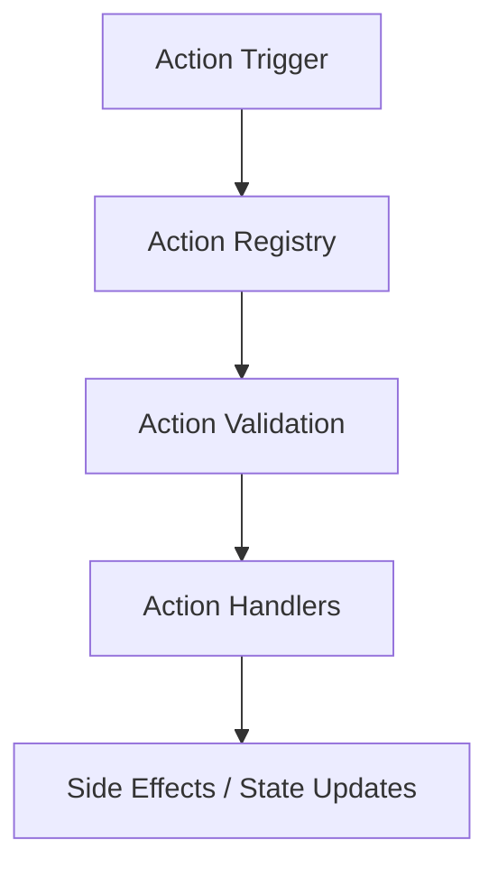

# Action System Architecture

This document provides an overview of the action system used in Karmyc Core, covering its design, components, and usage.

## Overview

Karmyc Core uses a modular action system based on a plugin architecture that allows registering action handlers with different priorities. This system allows decoupling action triggers (e.g., from UI elements like menus) from their implementation. It operates independently from the main state management library (Zustand).



## Core Components

### Action Types

```typescript
// Core action types used in the system
import { KarmycAction } from '../types/actions';

export type TActionHandler<T extends KarmycAction = KarmycAction> = (action: T) => void;

export interface IActionPlugin<T extends KarmycAction = KarmycAction> {
  id: string;
  priority: number;
  actionTypes: string[] | null; // null means all action types
  handler: TActionHandler<T>;
}

export interface IActionValidationResult {
  valid: boolean;
  message?: string;
}

export type TActionValidator<T extends KarmycAction = KarmycAction> = 
  (action: T) => IActionValidationResult;
```

### Action Registry

The action registry (`actionRegistry`) is the central component that manages action handlers, plugins, and validators:

```typescript
class ActionRegistry {
  // Registers an action plugin
  registerPlugin<T extends KarmycAction>(plugin: IActionPlugin<T>): void;
  
  // Unregisters an action plugin by its ID
  unregisterPlugin(id: string): void;
  
  // Registers a validator for a specific action type
  registerValidator<T extends KarmycAction>(
    actionType: string, 
    validator: TActionValidator<T>
  ): void;
  
  // Validates an action using registered validators
  validateAction(action: KarmycAction): IActionValidationResult;
  
  // Handles an action by sending it to all relevant plugins
  handleAction(action: KarmycAction): void;

  // Registers a simple handler for a specific action ID
  registerActionHandler(actionId: string, handler: (metadata?: any) => any): void;

  // Unregisters a handler for a specific action ID
  unregisterActionHandler(actionId: string): void;

  // Executes the handler associated with an action ID
  executeAction(actionId: string, metadata?: any): any;
}
```

## Priority System

The priority system controls the execution order of action plugins. Plugins with higher priority are executed first.

```typescript
export enum ActionPriority {
  CRITICAL = 1000,  // Critical actions (security, validation)
  HIGH = 800,       // Important actions (history, logging)
  NORMAL = 500,     // Standard actions
  LOW = 200,        // Low priority actions (analytics, etc.)
  BACKGROUND = 100  // Background actions
}
```

## Validation Mechanism

The validation system verifies that an action is valid before executing it. Each action type can have multiple validators.

```typescript
// Common validators
export const hasPayload: TActionValidator = (action: KarmycAction) => {
  if (!action.payload) {
    return {
      valid: false,
      message: `Action ${action.type} has no payload`
    };
  }
  return { valid: true };
};

export const hasRequiredFields = (fields: string[]): TActionValidator => {
  return (action: KarmycAction) => {
    for (const field of fields) {
      if (action.payload && action.payload[field] === undefined) {
        return {
          valid: false,
          message: `Action ${action.type} missing required field: ${field}`
        };
      }
    }
    return { valid: true };
  };
};
```

## React Hooks

The action system provides React hooks for easy integration with components:

```typescript
// Hook to register an action plugin
export function useActionPlugin<T extends KarmycAction = KarmycAction>(
  id: string,
  priority: number,
  actionTypes: string[] | null,
  handler: TActionHandler<T>
): void;

// Hook to register an action handler for a specific action ID
export function useRegisterActionHandler(
  actionId: string,
  handler: (metadata?: any) => any
): void;

// Hook to register an action validator
export function useActionValidator<T extends KarmycAction = KarmycAction>(
  actionType: string,
  validator: (action: T) => { valid: boolean; message?: string }
): void;
```

## Usage Examples

### Registering an Action Plugin

```typescript
function MyComponent() {
  useActionPlugin(
    'my-plugin',
    ActionPriority.NORMAL,
    ['area/addArea', 'area/removeArea'],
    (action) => {
      console.log('Action intercepted:', action);
      // Custom logic...
    }
  );
  
  // Rest of the component...
}
```

### Registering an Action Validator

```typescript
function MyComponent() {
  useActionValidator(
    'area/addArea',
    hasRequiredFields(['id', 'type'])
  );
  
  // Rest of the component...
}
```

### Registering and Executing an Action Handler

```typescript
function MyComponent() {
  // Register a handler when the component mounts
  useRegisterActionHandler('myComponent.doSomething', (metadata) => {
    console.log('Doing something with:', metadata);
    // Update Zustand store or perform side effects
  });
  
  // ... somewhere else (e.g., a button click, a menu item)
  const triggerAction = () => {
    actionRegistry.executeAction('myComponent.doSomething', { extraData: 123 });
  };
  
  // Rest of the component...
}
```

## Performance Considerations

The action system follows these principles to ensure good performance:

1. **Plugins sorted by priority**: Plugins are sorted once during registration, not for each action.
2. **Filtering by action type**: Plugins are called only for the action types they handle.
3. **Early validation**: Validation is performed before executing handlers to avoid unnecessary processing.
4. **Error handling**: Errors in one plugin do not affect other plugins. 
