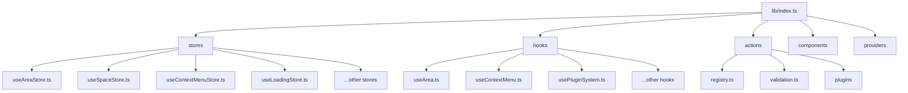
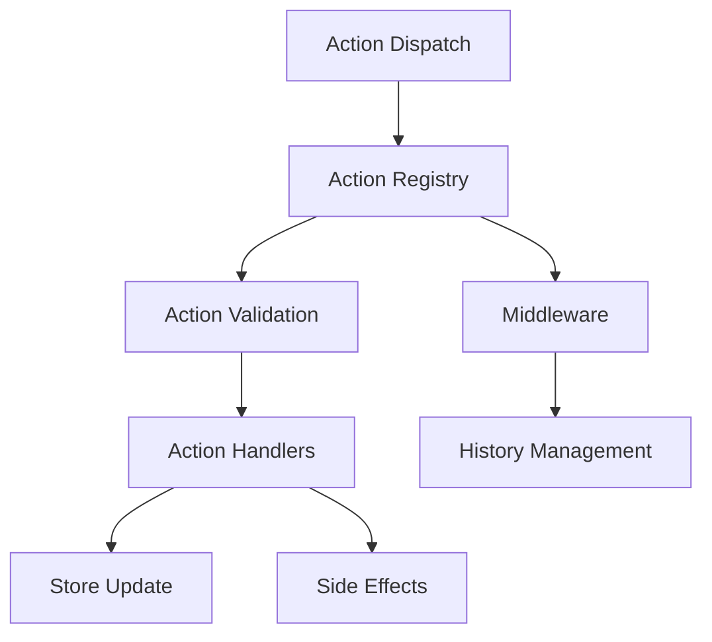
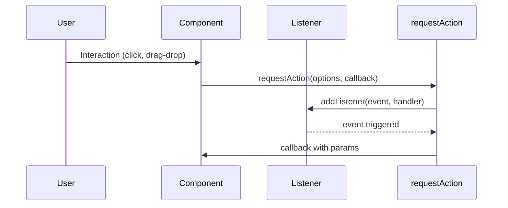

# Karmyc Core Architecture

This document provides an overview of the architecture and fundamental design patterns used in the Karmyc Core modular layout system.

## System Architecture

Karmyc Core follows a modular architecture built around Zustand for state management, with hooks for React integration. The system is designed to be flexible, extensible, and maintainable.



For a detailed overview of the project structure, please refer to the [Project Structure](./project-structure.md) document.

## State Management

Karmyc Core utilizes Zustand for decentralized state management. See the [Store Architecture](./store.md) document for details.

```mermaid
graph TD
    A[Application State (Distributed)] --> B[Area State (useAreaStore)]
    A --> C[Space State (useSpaceStore)]
    A --> D[Context Menu State (useContextMenuStore)]
    A --> F[Loading State (useLoadingStore)]
    A --> G[...]
```

## Action System

Karmyc Core uses a modular action system based on a plugin architecture that allows registering action handlers with different priorities. It's integrated with Zustand stores via custom middleware and hooks.



For a detailed explanation of the action system, see the [Action System](./actions.md) document.

## Data Flow

The data flow in Karmyc Core primarily uses Zustand's hook-based model, where components subscribe to state changes. For complex operations involving multiple steps or side effects, an operation pattern might be used, coordinating actions across different stores or services.

```mermaid
graph TD
    U[User] -->|Interaction| C[React Components]
    C -->|Call Action/Hook| Z[Zustand Stores]
    Z -->|Update State| Z
    Z -->|Notify Subscribers| C
    C -->|Update UI| C

    subgraph Complex Operation (Optional)
        C -->|Initiate Operation| O[Operation Handler]
        O -->|Dispatch Actions to Stores| Z
        O -->|Perform Side Effects| SE[External System / Diff]
        SE -->|Feedback/Updates| Z
    end
```

## Component Architecture

Karmyc Core provides a set of React components for building modular layouts:

1. **KarmycProvider**: The main provider component that wraps the application
2. **AreaRoot**: The container for all areas
3. **Area**: Individual area components that can be customized
4. **ContextMenu**: Context menu system
5. **Toolbar**: Toolbar components

These components are connected to the state management system and provide a seamless user experience.

## Integration Points

Karmyc Core provides several integration points for customization:

1. **Area Types**: Register custom area types with specific components and initial state
2. **Actions**: Register custom actions to extend functionality
3. **Keyboard Shortcuts**: Register keyboard shortcuts for specific area types
4. **Context Menus**: Create custom context menus for areas
5. **Plugins**: Register plugins to extend core functionality

These integration points allow for extensive customization while maintaining a consistent API and behavior.

## Usage Flow



This architecture provides a solid foundation for building complex layouts with drag-and-drop functionality, resizable areas, and rich user interactions. 
