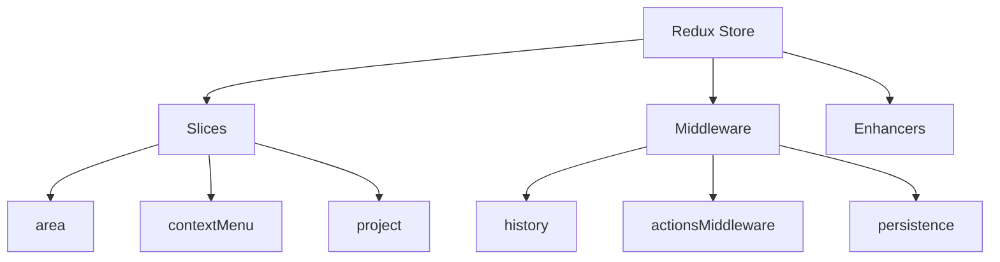
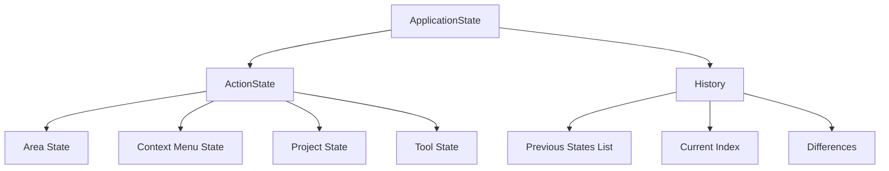

# Redux Store Architecture

This document outlines the Redux store architecture used in Karmyc Core, including its structure, slices, and middleware.

## Overview

Karmyc Core uses Redux Toolkit as its primary state management solution. The store is structured into multiple slices, each responsible for a specific domain of the application.



## Store Structure

The store is composed of two main parts:

1. **Application State**: The complete application state, including history
2. **Action State**: The current state without history, used for current operations



## Core Slices

### Area Slice

The Area slice manages the state of all areas in the layout:

```typescript
interface AreaState {
  areas: Record<string, Area>;
  activeAreaId: string | null;
  // Other area-related state...
}

const areaSlice = createSlice({
  name: 'area',
  initialState,
  reducers: {
    addArea: (state, action) => { /* ... */ },
    removeArea: (state, action) => { /* ... */ },
    updateArea: (state, action) => { /* ... */ },
    setActiveArea: (state, action) => { /* ... */ },
    // Other reducers...
  }
});
```

### Context Menu Slice

The Context Menu slice manages the state of context menus:

```typescript
interface ContextMenuState {
  isOpen: boolean;
  position: { x: number, y: number };
  items: ContextMenuItem[];
  // Other context menu related state...
}

const contextMenuSlice = createSlice({
  name: 'contextMenu',
  initialState,
  reducers: {
    openContextMenu: (state, action) => { /* ... */ },
    closeContextMenu: (state, action) => { /* ... */ },
    // Other reducers...
  }
});
```

### Project Slice

The Project slice manages project-specific state:

```typescript
interface ProjectState {
  id: string;
  name: string;
  settings: ProjectSettings;
  // Other project-related state...
}

const projectSlice = createSlice({
  name: 'project',
  initialState,
  reducers: {
    updateProject: (state, action) => { /* ... */ },
    setProjectSettings: (state, action) => { /* ... */ },
    // Other reducers...
  }
});
```

## Middleware

### History Middleware

The History middleware manages the undo/redo functionality:

```typescript
export const historyMiddleware: Middleware = store => next => action => {
  // Process action for history tracking
  if (shouldTrackInHistory(action)) {
    // Add to history stack
  }
  
  return next(action);
};
```

### Actions Middleware

The Actions middleware integrates with the action system:

```typescript
export const actionsMiddleware: Middleware = store => next => action => {
  // Execute the action normally in Redux
  const result = next(action);
  
  // Notify the action registry
  actionRegistry.handleAction(action);
  
  return result;
};
```

### Persistence Middleware

The Persistence middleware handles saving state to local storage:

```typescript
export const persistenceMiddleware: Middleware = store => next => action => {
  const result = next(action);
  
  // Save state to local storage after specific actions
  if (shouldPersist(action)) {
    const state = store.getState();
    saveToLocalStorage(state);
  }
  
  return result;
};
```

## Selectors

Karmyc Core provides memoized selectors for efficient state access:

```typescript
// Area selectors
export const selectAllAreas = (state: RootState) => state.area.areas;
export const selectActiveAreaId = (state: RootState) => state.area.activeAreaId;
export const selectActiveArea = createSelector(
  [selectAllAreas, selectActiveAreaId],
  (areas, activeId) => activeId ? areas[activeId] : null
);

// Context menu selectors
export const selectContextMenuState = (state: RootState) => state.contextMenu;
export const selectIsContextMenuOpen = (state: RootState) => state.contextMenu.isOpen;

// Project selectors
export const selectProject = (state: RootState) => state.project;
export const selectProjectSettings = (state: RootState) => state.project.settings;
```

## Integration with React

Karmyc Core provides custom hooks for working with the Redux store:

```typescript
// Use typed dispatch
export const useAppDispatch = () => useDispatch<AppDispatch>();

// Use typed selector
export const useAppSelector: TypedUseSelectorHook<RootState> = useSelector;

// Hook for area operations
export const useArea = () => {
  const dispatch = useAppDispatch();
  const areas = useAppSelector(selectAllAreas);
  const activeAreaId = useAppSelector(selectActiveAreaId);
  
  return {
    areas,
    activeAreaId,
    activeArea: activeAreaId ? areas[activeAreaId] : null,
    addArea: (areaData) => dispatch(addArea(areaData)),
    removeArea: (id) => dispatch(removeArea(id)),
    updateArea: (areaData) => dispatch(updateArea(areaData)),
    setActiveArea: (id) => dispatch(setActiveArea(id)),
  };
};

// Similar hooks for other slices...
```

## Store Configuration

The Redux store is configured with all slices, middleware, and enhancers:

```typescript
export const configureStore = () => {
  return createStore({
    reducer: {
      area: areaSlice.reducer,
      contextMenu: contextMenuSlice.reducer,
      project: projectSlice.reducer,
      // Other reducers...
    },
    middleware: (getDefaultMiddleware) => 
      getDefaultMiddleware().concat(
        historyMiddleware,
        actionsMiddleware,
        persistenceMiddleware
      ),
    devTools: process.env.NODE_ENV !== 'production',
    // Other store options...
  });
}; 
