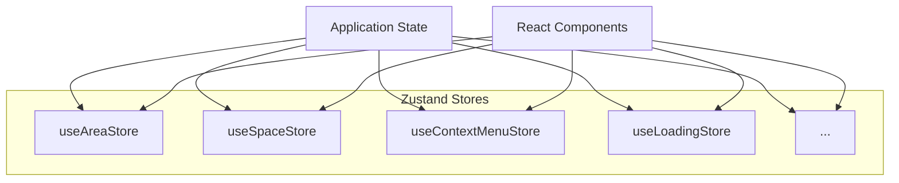

# Zustand Store Architecture

This document outlines the Zustand store architecture used in Karmyc Core.

## Overview

Karmyc Core utilizes Zustand for its state management. Instead of a single monolithic store, the state is divided into multiple independent stores (hooks), each responsible for a specific domain of the application. This approach promotes modularity, performance, and simplifies state management.



## Core Stores

Each store is created using Zustand's `create` function and typically combines state and actions within the same hook. Common middlewares like `devtools`, `persist`, and `immer` are used where appropriate.

### `useAreaStore`

Manages the state related to areas, layout, and their interactions.
- **State:** `areas`, `layout`, `activeAreaId`, `rootId`, `joinPreview`, `areaToOpen`, etc.
- **Actions:** `addArea`, `removeArea`, `updateArea`, `setActiveArea`, `splitArea`, `joinOrMoveArea`, `setRowSizes`, etc.
- **Middleware:** `devtools`, `persist` (partial), `immer`.

### `useSpaceStore`

Manages the state of different "spaces" which might contain shared drawing data or other context.
- **State:** `spaces`, `activeSpaceId`, `sharedState` per space (including `lines`, `pastDiffs`, `futureDiffs`).
- **Actions:** `addSpace`, `removeSpace`, `setActiveSpace`, `updateSpaceGenericSharedState`, `undoSharedState`, `redoSharedState`.
- **Middleware:** `devtools`, `persist` (partial, excludes history), `immer`.
- **History:** Implements custom diff-based history for `sharedState`.

### `useContextMenuStore`

Manages the state of the context menu (visibility, position, items).
- **State:** `isVisible`, `position`, `items`, `metadata`, `customContextMenu`.
- **Actions:** `openContextMenu`, `closeContextMenu`, `openCustomContextMenu`.
- **Middleware:** `devtools`, `immer`.

### `useLoadingStore`

Manages generic loading states identified by keys.
- **State:** `loadingStates`.
- **Actions:** `setLoading`, `clearLoading`.
- **Middleware:** `immer`.

*(Other potential stores might exist or be added as needed)*

## Middleware Usage

- **`devtools`**: Integrates with the Redux DevTools Extension for debugging.
- **`persist`**: Handles state persistence (usually to `localStorage`) for stores like `useAreaStore` and `useSpaceStore`. It's configured to only persist relevant parts of the state (partialize).
- **`immer`**: Allows for easier immutable state updates by enabling direct state mutation within actions.
- **`temporal` (zundo)**: *Previously* used for `areaStore` history, but currently inactive as the access hook (`useHistory`) was removed. `spaceStore` uses a custom diff-based history instead.

## Integration with React

Components access Zustand stores directly using the generated hooks:

```typescript
import { useAreaStore } from '@gamesberry/karmyc-core/stores/areaStore';

const MyComponent = () => {
  // Select specific state parts (Zustand handles optimization)
  const activeAreaId = useAreaStore((state) => state.activeAreaId);
  const areas = useAreaStore((state) => state.areas);

  // Select actions
  const setActiveArea = useAreaStore((state) => state.setActiveArea);
  const updateArea = useAreaStore((state) => state.updateArea);

  const handleActivate = (id: string) => {
    setActiveArea(id);
  };

  // Use the state and actions...
  return (
    <div>
      <p>Active Area: {activeAreaId}</p>
      {/* ... render areas ... */}
    </div>
  );
};
```

- **Selectors**: Components select only the necessary state slices. Zustand optimizes re-renders based on selector changes. Using `shallow` equality checks can further optimize selectors returning objects.
- **No Provider**: Zustand does not require a context Provider wrapping the application.

## Key Changes from the Previous (Redux) Implementation

- **Decentralized State**: State is split across multiple store hooks instead of one global object.
- **Simplified Actions/Reducers**: Actions are typically functions defined directly within the store, often mutating state directly thanks to `immer`. The strict separation of actions, reducers, and dispatch is gone.
- **Direct Hook Usage**: Components import and use the specific store hooks they need.
- **Middleware**: Zustand's middleware approach differs from Redux middleware. It's applied during store creation using composition.
- **History**: Handled via middleware (`temporal`/`zundo`) or custom logic within the store, not a dedicated slice/middleware combination.
