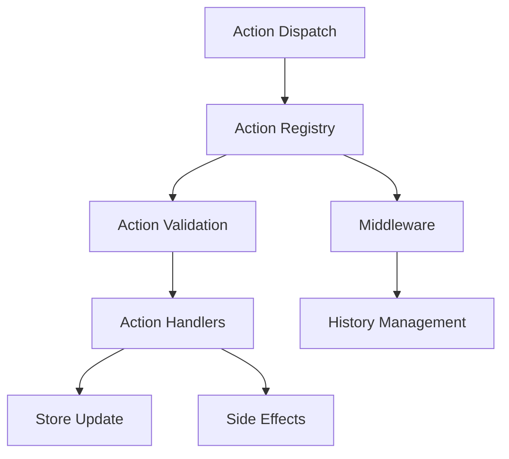

# Conception du Système d'Actions Modulaire

## 1. Introduction

Ce document présente la conception détaillée du système d'actions modulaire pour le core layout system de l'éditeur d'animation. Ce système vise à remplacer et améliorer le système d'actions existant en le rendant plus modulaire, extensible et maintenable.

## 2. Analyse du système existant

### 2.1 Composants actuels

Le système d'actions actuel est réparti dans plusieurs fichiers et dossiers :

- `src/state/operation.ts` : Définit les opérations qui regroupent plusieurs actions
- `src/state/history/historyActions.ts` : Définit les actions liées à l'historique
- `src/listener/requestAction.ts` : Gère les demandes d'actions et leur exécution
- `src/types.ts` : Définit les types liés aux actions et opérations

### 2.2 Flux d'exécution actuel

1. Une action est demandée via `requestAction`
2. Un identifiant d'action est généré
3. L'action est démarrée avec `historyActions.startAction`
4. Des actions sont dispatched via `params.dispatch`
5. Des différences (diffs) peuvent être ajoutées via `params.addDiff`
6. L'action est soumise via `params.submitAction` ou annulée via `params.cancelAction`

### 2.3 Limitations du système actuel

- Couplage fort entre les différents composants
- Manque de modularité pour ajouter de nouveaux types d'actions
- Pas de système de priorité pour les actions
- Validation des actions limitée
- Documentation insuffisante

## 3. Architecture proposée

### 3.1 Vue d'ensemble

Le nouveau système d'actions sera basé sur une architecture de plugins, permettant d'enregistrer des gestionnaires d'actions avec différentes priorités. Il sera intégré avec Redux-Toolkit et fournira des hooks React pour faciliter son utilisation.



### 3.2 Composants principaux

#### 3.2.1 Types d'actions

```typescript
// src/core/types/actions.ts
import { AnyAction } from '@reduxjs/toolkit';

export type TActionHandler<T extends AnyAction = AnyAction> = (action: T) => void;

export interface IActionPlugin<T extends AnyAction = AnyAction> {
  id: string;
  priority: number;
  actionTypes: string[] | null; // null signifie tous les types d'actions
  handler: TActionHandler<T>;
}

export interface IActionValidationResult {
  valid: boolean;
  message?: string;
}

export type TActionValidator<T extends AnyAction = AnyAction> = (action: T) => IActionValidationResult;

export interface IActionRegistryOptions {
  enableLogging?: boolean;
  defaultValidators?: Record<string, TActionValidator[]>;
}
```

#### 3.2.2 Registre d'actions

```typescript
// src/core/actions/registry.ts
import { AnyAction } from '@reduxjs/toolkit';
import { 
  IActionPlugin, 
  TActionValidator, 
  IActionValidationResult,
  IActionRegistryOptions
} from '../types/actions';

class ActionRegistry {
  private plugins: IActionPlugin[] = [];
  private validators: Record<string, TActionValidator[]> = {};
  private options: IActionRegistryOptions;

  constructor(options: IActionRegistryOptions = {}) {
    this.options = {
      enableLogging: false,
      ...options
    };
    
    if (options.defaultValidators) {
      this.validators = { ...options.defaultValidators };
    }
  }

  /**
   * Enregistre un plugin d'action
   */
  registerPlugin<T extends AnyAction>(plugin: IActionPlugin<T>): void {
    this.plugins.push(plugin);
    // Trier par priorité (priorité plus élevée = exécuté en premier)
    this.plugins.sort((a, b) => b.priority - a.priority);
    
    if (this.options.enableLogging) {
      console.log(`Plugin d'action enregistré: ${plugin.id} avec priorité ${plugin.priority}`);
    }
  }

  /**
   * Désenregistre un plugin d'action par son ID
   */
  unregisterPlugin(id: string): void {
    this.plugins = this.plugins.filter(plugin => plugin.id !== id);
    
    if (this.options.enableLogging) {
      console.log(`Plugin d'action désenregistré: ${id}`);
    }
  }

  /**
   * Enregistre un validateur pour un type d'action spécifique
   */
  registerValidator<T extends AnyAction>(actionType: string, validator: TActionValidator<T>): void {
    if (!this.validators[actionType]) {
      this.validators[actionType] = [];
    }
    this.validators[actionType].push(validator as TActionValidator);
    
    if (this.options.enableLogging) {
      console.log(`Validateur enregistré pour le type d'action: ${actionType}`);
    }
  }

  /**
   * Désenregistre tous les validateurs pour un type d'action
   */
  unregisterValidators(actionType: string): void {
    delete this.validators[actionType];
    
    if (this.options.enableLogging) {
      console.log(`Validateurs désenregistrés pour le type d'action: ${actionType}`);
    }
  }

  /**
   * Valide une action
   */
  validateAction(action: AnyAction): IActionValidationResult {
    const validators = this.validators[action.type] || [];
    
    for (const validator of validators) {
      const result = validator(action);
      if (!result.valid) {
        if (this.options.enableLogging) {
          console.warn(`Validation de l'action échouée: ${result.message}`);
        }
        return result;
      }
    }
    
    return { valid: true };
  }

  /**
   * Gère une action en l'envoyant à tous les plugins concernés
   */
  handleAction(action: AnyAction): void {
    // Valider l'action
    const validationResult = this.validateAction(action);
    if (!validationResult.valid) {
      console.warn(`Action non valide: ${validationResult.message}`);
      return;
    }
    
    // Exécuter les handlers des plugins
    for (const plugin of this.plugins) {
      // Vérifier si le plugin gère ce type d'action
      if (plugin.actionTypes === null || plugin.actionTypes.includes(action.type)) {
        try {
          plugin.handler(action);
        } catch (error) {
          console.error(`Erreur dans le plugin ${plugin.id}:`, error);
        }
      }
    }
  }
}

// Exporter une instance singleton
export const actionRegistry = new ActionRegistry();

// Exporter la classe pour permettre la création d'instances personnalisées
export { ActionRegistry };
```

#### 3.2.3 Middleware Redux

```typescript
// src/core/store/middleware/actions.ts
import { Middleware } from '@reduxjs/toolkit';
import { actionRegistry } from '../../actions/registry';

export const actionsMiddleware: Middleware = store => next => action => {
  // Exécuter l'action normalement dans Redux
  const result = next(action);
  
  // Notifier le registre d'actions
  actionRegistry.handleAction(action);
  
  return result;
};
```

### 3.3 Hooks React

```typescript
// src/core/hooks/useActionPlugin.ts
import { useEffect } from 'react';
import { AnyAction } from '@reduxjs/toolkit';
import { actionRegistry } from '../actions/registry';
import { IActionPlugin, TActionHandler } from '../types/actions';

/**
 * Hook pour enregistrer un plugin d'action
 */
export function useActionPlugin<T extends AnyAction = AnyAction>(
  id: string,
  priority: number,
  actionTypes: string[] | null,
  handler: TActionHandler<T>
): void {
  useEffect(() => {
    const plugin: IActionPlugin<T> = {
      id,
      priority,
      actionTypes,
      handler
    };
    
    actionRegistry.registerPlugin(plugin);
    
    // Nettoyer lors du démontage du composant
    return () => {
      actionRegistry.unregisterPlugin(id);
    };
  }, [id, priority, actionTypes, handler]);
}

/**
 * Hook pour enregistrer un validateur d'action
 */
export function useActionValidator<T extends AnyAction = AnyAction>(
  actionType: string,
  validator: (action: T) => { valid: boolean; message?: string }
): void {
  useEffect(() => {
    actionRegistry.registerValidator(actionType, validator as any);
    
    // Nettoyer lors du démontage du composant
    return () => {
      actionRegistry.unregisterValidators(actionType);
    };
  }, [actionType, validator]);
}
```

## 4. Système de priorité

Le système de priorité permet de contrôler l'ordre d'exécution des plugins d'action. Les plugins avec une priorité plus élevée sont exécutés en premier.

### 4.1 Niveaux de priorité recommandés

```typescript
// src/core/actions/priorities.ts
export enum ActionPriority {
  CRITICAL = 1000,  // Actions critiques (sécurité, validation)
  HIGH = 800,       // Actions importantes (historique, journalisation)
  NORMAL = 500,     // Actions standard
  LOW = 200,        // Actions de faible priorité (analytics, etc.)
  BACKGROUND = 100  // Actions en arrière-plan
}
```

## 5. Mécanisme de validation des actions

Le système de validation permet de vérifier qu'une action est valide avant de l'exécuter. Chaque type d'action peut avoir plusieurs validateurs.

### 5.1 Validateurs communs

```typescript
// src/core/actions/validators.ts
import { AnyAction } from '@reduxjs/toolkit';
import { TActionValidator, IActionValidationResult } from '../types/actions';

/**
 * Validateur qui vérifie que l'action a un payload
 */
export const hasPayload: TActionValidator = (action: AnyAction): IActionValidationResult => {
  if (!action.payload) {
    return {
      valid: false,
      message: `L'action ${action.type} n'a pas de payload`
    };
  }
  return { valid: true };
};

/**
 * Crée un validateur qui vérifie que le payload a certaines propriétés
 */
export const hasRequiredFields = (fields: string[]): TActionValidator => {
  return (action: AnyAction): IActionValidationResult => {
    for (const field of fields) {
      if (action.payload && action.payload[field] === undefined) {
        return {
          valid: false,
          message: `L'action ${action.type} n'a pas la propriété requise: ${field}`
        };
      }
    }
    return { valid: true };
  };
};
```

## 6. Intégration avec le système d'historique

Le système d'actions sera intégré avec le système d'historique pour permettre l'annulation et la restauration des actions.

```typescript
// src/core/actions/plugins/historyPlugin.ts
import { AnyAction } from '@reduxjs/toolkit';
import { IActionPlugin } from '../../types/actions';
import { ActionPriority } from '../priorities';
import { store } from '../../store';

// Liste des types d'actions qui doivent être enregistrées dans l'historique
const HISTORY_ACTION_TYPES = [
  'area/addArea',
  'area/removeArea',
  'area/updateArea',
  // Autres types d'actions...
];

export const historyPlugin: IActionPlugin = {
  id: 'history',
  priority: ActionPriority.HIGH,
  actionTypes: HISTORY_ACTION_TYPES,
  handler: (action: AnyAction) => {
    // Logique pour enregistrer l'action dans l'historique
    // Cette logique dépendra de l'implémentation du système d'historique
    console.log(`Action enregistrée dans l'historique: ${action.type}`);
  }
};
```

## 7. Exemples d'utilisation

### 7.1 Enregistrement d'un plugin d'action

```typescript
// Exemple d'utilisation dans un composant React
import { useActionPlugin } from '../core/hooks/useActionPlugin';
import { ActionPriority } from '../core/actions/priorities';

function MyComponent() {
  useActionPlugin(
    'my-plugin',
    ActionPriority.NORMAL,
    ['area/addArea', 'area/removeArea'],
    (action) => {
      console.log('Action interceptée:', action);
      // Logique personnalisée...
    }
  );
  
  // Reste du composant...
}
```

### 7.2 Enregistrement d'un validateur d'action

```typescript
// Exemple d'utilisation dans un composant React
import { useActionValidator } from '../core/hooks/useActionPlugin';
import { hasRequiredFields } from '../core/actions/validators';

function MyComponent() {
  useActionValidator(
    'area/addArea',
    hasRequiredFields(['id', 'type'])
  );
  
  // Reste du composant...
}
```

### 7.3 Dispatch d'une action avec validation

```typescript
// Exemple d'utilisation avec le store Redux
import { useAppDispatch } from '../core/hooks';
import { addArea } from '../core/store/slices/area';

function MyComponent() {
  const dispatch = useAppDispatch();
  
  const handleAddArea = () => {
    // L'action sera validée par le système d'actions
    dispatch(addArea({ id: 'area-1', type: 'editor' }));
  };
  
  // Reste du composant...
}
```

## 8. Considérations de performance

Pour assurer de bonnes performances, le système d'actions suit ces principes :

1. **Tri des plugins par priorité** : Les plugins sont triés une seule fois lors de l'enregistrement, pas à chaque action.
2. **Filtrage par type d'action** : Les plugins ne sont appelés que pour les types d'actions qu'ils gèrent.
3. **Validation précoce** : La validation est effectuée avant d'exécuter les handlers pour éviter des traitements inutiles.
4. **Gestion des erreurs** : Les erreurs dans un plugin n'affectent pas les autres plugins.

## 9. Conclusion

Le système d'actions modulaire proposé offre une solution flexible et extensible pour gérer les actions dans l'application. Il permet :

- L'enregistrement dynamique de plugins d'action
- La validation des actions avant leur exécution
- La priorisation des handlers d'action
- L'intégration avec Redux-Toolkit et le système d'historique
- Une API simple basée sur des hooks React

Cette architecture facilitera l'ajout de nouvelles fonctionnalités et l'extension du système existant tout en maintenant une base de code propre et maintenable. 
