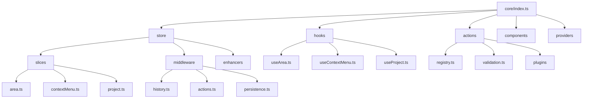

# Conception détaillée du Store Redux-Toolkit (Mise à jour)

## 1. Structure du Store

### 1.1 Vue d'ensemble

Le nouveau store Redux-Toolkit sera organisé selon une architecture modulaire qui sépare clairement les différentes préoccupations, tout en respectant la structure proposée dans l'analyse technique (section 4.1) pour un composant bundlisable :

- **Slices** : Modules fonctionnels avec leurs propres reducers et actions
- **Middleware** : Logique intermédiaire pour intercepter et traiter les actions
- **Hooks** : Fonctions utilitaires pour accéder au store depuis les composants
- **Système d'historique** : Gestion des opérations undo/redo
- **Système d'actions** : Enregistrement et exécution d'actions complexes

### 1.2 Structure de dossiers alignée avec l'analyse technique

```
src/
└── core/
    ├── index.ts                 # Point d'entrée principal (exports publics)
    ├── types/                   # Types et interfaces partagés
    │   ├── index.ts             # Export des types publics
    │   ├── internal.ts          # Types internes (non exportés)
    │   ├── area.ts              # Types liés aux zones
    │   ├── store.ts             # Types liés au store
    │   └── ...
    ├── store/                   # Gestion de l'état global
    │   ├── index.ts             # Export public du store
    │   ├── slices/              # Slices Redux pour chaque domaine
    │   │   ├── area.ts          # Gestion des zones
    │   │   ├── contextMenu.ts   # Gestion des menus contextuels
    │   │   ├── project.ts       # Gestion des projets
    │   │   ├── state.ts         # Gestion des transitions d'état
    │   │   ├── diff.ts          # Gestion des différences d'état
    │   │   └── toolbar.ts       # Gestion de la barre d'outils
    │   ├── middleware/          # Middleware Redux personnalisés
    │   │   ├── index.ts
    │   │   ├── history.ts       # Middleware pour l'historique
    │   │   ├── actions.ts       # Middleware pour les actions
    │   │   └── persistence.ts   # Middleware pour la persistance
    │   ├── enhancers/           # Enhancers Redux
    │   └── serialization/       # Logique de sérialisation/désérialisation
    ├── hooks/                   # Hooks React pour l'API publique
    │   ├── index.ts             # Export des hooks publics
    │   ├── useArea.ts           # Hook pour la gestion des zones
    │   ├── useContextMenu.ts    # Hook pour les menus contextuels
    │   ├── useProject.ts        # Hook pour la gestion des projets
    │   └── ...
    ├── actions/                 # Système d'actions modulaire
    │   ├── index.ts             # Export des actions publiques
    │   ├── registry.ts          # Registre central des actions
    │   ├── types.ts             # Types d'actions
    │   ├── validation.ts        # Validation des actions
    │   └── plugins/             # Système de plugins pour les actions
    ├── history/                 # Système d'historique
    │   ├── index.ts             # Export des fonctionnalités d'historique
    │   ├── undoable.ts          # Intégration avec redux-undo
    │   ├── diff.ts              # Génération de différences
    │   └── selectors.ts         # Sélecteurs pour l'historique
    ├── components/              # Composants React réutilisables
    │   ├── index.ts             # Export des composants publics
    │   ├── Area.tsx             # Composant de zone
    │   ├── ContextMenu.tsx      # Composant de menu contextuel
    │   └── ...
    ├── utils/                   # Fonctions utilitaires
    │   ├── index.ts             # Export des utilitaires publics
    │   ├── history.ts           # Utilitaires pour l'historique
    │   ├── diff.ts              # Utilitaires pour les différences
    │   └── ...
    ├── providers/               # Providers React pour le contexte
    │   ├── index.ts             # Export des providers
    │   ├── CoreProvider.tsx     # Provider principal
    │   └── ...
    └── constants/               # Constantes partagées
        ├── index.ts             # Export des constantes publiques
        └── ...
```

### 1.3 Diagramme de la structure



## 2. Conception des Slices

### 2.1 Principes généraux

Chaque slice représente un domaine fonctionnel de l'application et encapsule :
- L'état initial du domaine
- Les reducers pour modifier cet état
- Les actions qui peuvent être dispatched
- Les sélecteurs pour accéder à l'état

### 2.2 Structure d'un Slice

```typescript
// src/store/slices/area.ts
import { createSlice, PayloadAction } from '@reduxjs/toolkit';
import { TArea, TAreaState } from '../../types/area';

const initialState: TAreaState = {
  areas: [],
  activeAreaId: null,
};

export const areaSlice = createSlice({
  name: 'area',
  initialState,
  reducers: {
    addArea: (state, action: PayloadAction<TArea>) => {
      state.areas.push(action.payload);
    },
    removeArea: (state, action: PayloadAction<string>) => {
      state.areas = state.areas.filter(area => area.id !== action.payload);
    },
    updateArea: (state, action: PayloadAction<{ id: string; changes: Partial<TArea> }>) => {
      const { id, changes } = action.payload;
      const areaIndex = state.areas.findIndex(area => area.id === id);
      if (areaIndex !== -1) {
        state.areas[areaIndex] = { ...state.areas[areaIndex], ...changes };
      }
    },
    setActiveArea: (state, action: PayloadAction<string | null>) => {
      state.activeAreaId = action.payload;
    },
  },
});

export const { addArea, removeArea, updateArea, setActiveArea } = areaSlice.actions;
export default areaSlice.reducer;
```

### 2.3 Exemples des autres Slices

#### 2.3.1 Slice de Transition d'État

```typescript
// src/store/slices/state.ts
import { createSlice, PayloadAction } from '@reduxjs/toolkit';
import { TStateTransition, TStateState } from '../../types/state';

const initialState: TStateState = {
  states: {},
  transitions: [],
};

export const stateSlice = createSlice({
  name: 'state',
  initialState,
  reducers: {
    transitionState: (state, action: PayloadAction<TStateTransition>) => {
      const { id, transition, data } = action.payload;
      if (state.states[id]) {
        state.states[id] = {
          ...state.states[id],
          currentState: transition,
          lastTransition: {
            to: transition,
            data,
            timestamp: new Date().toISOString(),
          },
        };
      }
    },
    registerTransition: (state, action: PayloadAction<{
      from: string;
      to: string;
      condition: (state: any) => boolean;
      action: (state: any, data: any) => void;
    }>) => {
      state.transitions.push(action.payload);
    },
  },
});

export const { transitionState, registerTransition } = stateSlice.actions;
export default stateSlice.reducer;
```

#### 2.3.2 Slice de Différences

```typescript
// src/store/slices/diff.ts
import { createSlice, PayloadAction } from '@reduxjs/toolkit';
import { TDiff, TDiffState } from '../../types/diff';

const initialState: TDiffState = {
  diffs: [],
  currentDiffIndex: -1,
};

export const diffSlice = createSlice({
  name: 'diff',
  initialState,
  reducers: {
    addDiff: (state, action: PayloadAction<TDiff>) => {
      state.diffs.push(action.payload);
      state.currentDiffIndex = state.diffs.length - 1;
    },
    setCurrentDiff: (state, action: PayloadAction<number>) => {
      state.currentDiffIndex = action.payload;
    },
    clearDiffs: (state) => {
      state.diffs = [];
      state.currentDiffIndex = -1;
    },
  },
});

export const { addDiff, setCurrentDiff, clearDiffs } = diffSlice.actions;
export default diffSlice.reducer;
```

#### 2.3.3 Slice de Barre d'Outils

```typescript
// src/store/slices/toolbar.ts
import { createSlice, PayloadAction } from '@reduxjs/toolkit';
import { TToolbarState, TToolbarAction } from '../../types/toolbar';

const initialState: TToolbarState = {
  actions: [],
  activeAction: null,
  isVisible: true,
};

export const toolbarSlice = createSlice({
  name: 'toolbar',
  initialState,
  reducers: {
    addToolbarAction: (state, action: PayloadAction<TToolbarAction>) => {
      state.actions.push(action.payload);
    },
    setActiveAction: (state, action: PayloadAction<string | null>) => {
      state.activeAction = action.payload;
    },
    toggleToolbar: (state) => {
      state.isVisible = !state.isVisible;
    },
  },
});

export const { addToolbarAction, setActiveAction, toggleToolbar } = toolbarSlice.actions;
export default toolbarSlice.reducer;
```

### 2.4 Sélecteurs

Les sélecteurs sont définis dans le même fichier que le slice ou dans un fichier séparé pour les sélecteurs plus complexes :

```typescript
// src/store/slices/area.ts (suite)
import { createSelector } from '@reduxjs/toolkit';
import { RootState } from '../../types/store';

export const selectAreaState = (state: RootState) => state.area;

export const selectAllAreas = createSelector(
  selectAreaState,
  areaState => areaState.areas
);

export const selectActiveAreaId = createSelector(
  selectAreaState,
  areaState => areaState.activeAreaId
);

export const selectActiveArea = createSelector(
  [selectAllAreas, selectActiveAreaId],
  (areas, activeAreaId) => 
    activeAreaId ? areas.find(area => area.id === activeAreaId) : null
);

export const selectAreaById = (id: string) => 
  createSelector(
    selectAllAreas,
    areas => areas.find(area => area.id === id)
  );
```

## 3. Configuration du Store

### 3.1 Point d'entrée du Store

```typescript
// src/store/index.ts
import { configureStore } from '@reduxjs/toolkit';
import { rootReducer } from './rootReducer';
import { historyMiddleware } from './middleware/history';
import { actionsMiddleware } from './middleware/actions';
import { persistenceMiddleware } from './middleware/persistence';

export const createCoreStore = (options = {}) => {
  return configureStore({
    reducer: rootReducer,
    middleware: (getDefaultMiddleware) => 
      getDefaultMiddleware({
        serializableCheck: {
          // Ignorer certaines actions non-sérialisables si nécessaire
          ignoredActions: ['history/SUBMIT_ACTION'],
        },
      }).concat(historyMiddleware, actionsMiddleware, persistenceMiddleware),
    ...options,
  });
};

// Créer une instance par défaut du store
export const store = createCoreStore();

// Exporter les types
export type RootState = ReturnType<typeof store.getState>;
export type AppDispatch = typeof store.dispatch;

// Exporter les sélecteurs et actions
export * from './slices/area';
export * from './slices/contextMenu';
export * from './slices/project';
// ... autres exports
```

### 3.2 Root Reducer

```typescript
// src/store/rootReducer.ts
import { combineReducers } from '@reduxjs/toolkit';
import areaReducer from './slices/area';
import contextMenuReducer from './slices/contextMenu';
import projectReducer from './slices/project';
// Importer d'autres reducers...

export const rootReducer = combineReducers({
  area: areaReducer,
  contextMenu: contextMenuReducer,
  project: projectReducer,
  // Autres reducers...
});
```

## 4. Système d'historique

### 4.1 Intégration avec redux-undo

```typescript
// src/history/undoable.ts
import undoable, { includeAction, excludeAction, StateWithHistory } from 'redux-undo';
import { Reducer } from '@reduxjs/toolkit';
import { TUndoableOptions } from '../types/history';

export function createUndoableReducer<S>(
  reducer: Reducer<S>,
  options: TUndoableOptions = {}
): Reducer<StateWithHistory<S>> {
  return undoable(reducer, {
    limit: 50,
    filter: includeAction([
      // Actions à inclure dans l'historique
    ]),
    ...options,
  });
}
```

### 4.2 Middleware d'historique

```typescript
// src/store/middleware/history.ts
import { Middleware } from '@reduxjs/toolkit';
import { ActionCreators } from 'redux-undo';
import { generateDiff } from '../../utils/diff';

export const historyMiddleware: Middleware = store => next => action => {
  // Avant d'exécuter l'action
  const prevState = store.getState();
  
  // Exécuter l'action
  const result = next(action);
  
  // Après l'exécution de l'action
  const nextState = store.getState();
  
  // Générer les différences si nécessaire
  if (action.type.startsWith('history/')) {
    const diffs = generateDiff(prevState, nextState);
    // Stocker les différences pour visualisation
  }
  
  return result;
};
```

### 4.3 Sélecteurs pour l'historique

```typescript
// src/history/selectors.ts
import { createSelector } from '@reduxjs/toolkit';
import { RootState } from '../types/store';

export const selectCanUndo = (state: RootState) => {
  // Vérifier pour chaque slice s'il y a des actions à annuler
  return Object.keys(state).some(key => {
    const slice = state[key];
    return slice.past && slice.past.length > 0;
  });
};

export const selectCanRedo = (state: RootState) => {
  // Vérifier pour chaque slice s'il y a des actions à refaire
  return Object.keys(state).some(key => {
    const slice = state[key];
    return slice.future && slice.future.length > 0;
  });
};

export const selectHistoryLength = createSelector(
  (state: RootState) => state,
  (state) => {
    // Calculer la longueur totale de l'historique
    return Object.keys(state).reduce((total, key) => {
      const slice = state[key];
      return total + (slice.past ? slice.past.length : 0);
    }, 0);
  }
);
```

## 5. Système d'actions modulaire

### 5.1 Types d'actions

```typescript
// src/types/actions.ts
import { AnyAction } from '@reduxjs/toolkit';

export type TActionHandler = (action: AnyAction) => void;

export interface IActionPlugin {
  id: string;
  priority: number;
  handler: TActionHandler;
}

export interface IActionValidationResult {
  valid: boolean;
  message?: string;
}

export type TActionValidator = (action: AnyAction) => IActionValidationResult;
```

### 5.2 Registre d'actions

```typescript
// src/actions/registry.ts
import { AnyAction } from '@reduxjs/toolkit';
import { IActionPlugin, TActionValidator, IActionValidationResult } from '../types/actions';

class ActionRegistry {
  private plugins: IActionPlugin[] = [];
  private validators: Record<string, TActionValidator[]> = {};

  registerPlugin(plugin: IActionPlugin) {
    this.plugins.push(plugin);
    // Trier par priorité
    this.plugins.sort((a, b) => b.priority - a.priority);
  }

  unregisterPlugin(id: string) {
    this.plugins = this.plugins.filter(plugin => plugin.id !== id);
  }

  registerValidator(actionType: string, validator: TActionValidator) {
    if (!this.validators[actionType]) {
      this.validators[actionType] = [];
    }
    this.validators[actionType].push(validator);
  }

  validateAction(action: AnyAction): IActionValidationResult {
    const validators = this.validators[action.type] || [];
    
    for (const validator of validators) {
      const result = validator(action);
      if (!result.valid) {
        return result;
      }
    }
    
    return { valid: true };
  }

  handleAction(action: AnyAction) {
    // Valider l'action
    const validationResult = this.validateAction(action);
    if (!validationResult.valid) {
      console.warn(`Action validation failed: ${validationResult.message}`);
      return;
    }
    
    // Exécuter les handlers
    for (const plugin of this.plugins) {
      plugin.handler(action);
    }
  }
}

export const actionRegistry = new ActionRegistry();
```

### 5.3 Middleware d'actions

```typescript
// src/store/middleware/actions.ts
import { Middleware } from '@reduxjs/toolkit';
import { actionRegistry } from '../../actions/registry';

export const actionsMiddleware: Middleware = store => next => action => {
  // Exécuter l'action normalement
  const result = next(action);
  
  // Notifier les plugins
  actionRegistry.handleAction(action);
  
  return result;
};
```

## 6. Hooks personnalisés

### 6.1 Hooks de base

```typescript
// src/hooks/index.ts
import { TypedUseSelectorHook, useDispatch, useSelector } from 'react-redux';
import { RootState, AppDispatch } from '../store';

export const useAppDispatch = () => useDispatch<AppDispatch>();
export const useAppSelector: TypedUseSelectorHook<RootState> = useSelector;
```

### 6.2 Hooks spécifiques

```typescript
// src/hooks/useArea.ts
import { useCallback } from 'react';
import { useAppDispatch, useAppSelector } from './index';
import { addArea, removeArea, updateArea, setActiveArea, selectAllAreas, selectActiveArea } from '../store/slices/area';
import { TArea } from '../types/area';

export function useArea() {
  const dispatch = useAppDispatch();
  const areas = useAppSelector(selectAllAreas);
  const activeArea = useAppSelector(selectActiveArea);
  
  const addNewArea = useCallback((area: TArea) => {
    dispatch(addArea(area));
  }, [dispatch]);
  
  const deleteArea = useCallback((id: string) => {
    dispatch(removeArea(id));
  }, [dispatch]);
  
  const updateExistingArea = useCallback((id: string, changes: Partial<TArea>) => {
    dispatch(updateArea({ id, changes }));
  }, [dispatch]);
  
  const activateArea = useCallback((id: string | null) => {
    dispatch(setActiveArea(id));
  }, [dispatch]);
  
  return {
    areas,
    activeArea,
    addNewArea,
    deleteArea,
    updateExistingArea,
    activateArea,
  };
}
```

### 6.3 Hook d'initialisation

```typescript
// src/hooks/useInitialize.ts
import { useEffect } from 'react';
import { useAppDispatch } from './index';
import { actionRegistry } from '../actions/registry';
import { IInitializeOptions } from '../types/karmyc';

export function useInitialize(options: IInitializeOptions = {}) {
  const dispatch = useAppDispatch();
  
  useEffect(() => {
    // Enregistrer les plugins
    const pluginIds: string[] = [];
    if (options.plugins) {
      options.plugins.forEach(plugin => {
        actionRegistry.registerPlugin(plugin);
        pluginIds.push(plugin.id);
      });
    }
    
    // Enregistrer les validateurs
    if (options.validators) {
      options.validators.forEach(({ actionType, validator }) => {
        actionRegistry.registerValidator(actionType, validator);
      });
    }
    
    // Nettoyer lors du démontage
    return () => {
      pluginIds.forEach(id => {
        actionRegistry.unregisterPlugin(id);
      });
    };
  }, [dispatch, options]);
}
```

## 7. Provider principal

```typescript
// src/providers/CoreProvider.tsx
import React, { ReactNode } from 'react';
import { Provider } from 'react-redux';
import { store } from '../store';
import { IInitializeOptions } from '../types/karmyc';
import { useInitialize } from '../hooks/useInitialize';

interface CoreProviderProps {
  children: ReactNode;
  options?: IInitializeOptions;
  customStore?: typeof store;
}

const KarmycInitializer: React.FC<{ options?: IInitializeOptions }> = ({ options = {} }) => {
  useInitialize(options);
  return null;
};

export const CoreProvider: React.FC<CoreProviderProps> = ({ 
  children, 
  options = {},
  customStore = store
}) => {
  return (
    <Provider store={customStore}>
      <KarmycInitializer options={options} />
      {children}
    </Provider>
  );
};
```

## 8. Point d'entrée principal

```typescript
// src/index.ts
// Exporter les hooks publics
export * from './hooks';

// Exporter les composants publics
export * from './components';

// Exporter les types publics
export * from './types';

// Exporter les constantes publiques
export * from './constants';

// Exporter le provider principal
export { CoreProvider } from './providers/CoreProvider';

// Exporter la fonction d'initialisation
export { createCoreStore, store } from './store';

// Exporter les actions publiques
export {
  // Actions de area
  addArea,
  removeArea,
  updateArea,
  setActiveArea,
  
  // Actions de contextMenu
  openContextMenu,
  closeContextMenu,
  
  // Actions de project
  createProject,
  updateProject,
  
  // ... autres actions
} from './store';
```

## 9. Stratégie de migration

La stratégie de migration reste la même que celle décrite précédemment, mais avec une structure de dossiers alignée sur l'analyse technique pour un composant bundlisable.

## 10. Conclusion

Cette conception mise à jour du store Redux-Toolkit s'aligne parfaitement avec la structure proposée dans l'analyse technique (section 4.1) pour un composant bundlisable. Elle maintient les fonctionnalités essentielles du système actuel tout en tirant parti des avantages de Redux-Toolkit pour simplifier le code et améliorer la maintenabilité.

La structure modulaire facilite le bundling et la distribution via npm, avec une séparation claire entre l'API publique et l'implémentation interne. Les exports explicites permettent un contrôle précis sur l'API exposée et facilitent le tree-shaking lors du bundling.

Les prochaines étapes consistent à implémenter cette conception en commençant par la structure de base du store, puis en migrant progressivement les différents domaines fonctionnels vers les nouveaux slices. 
